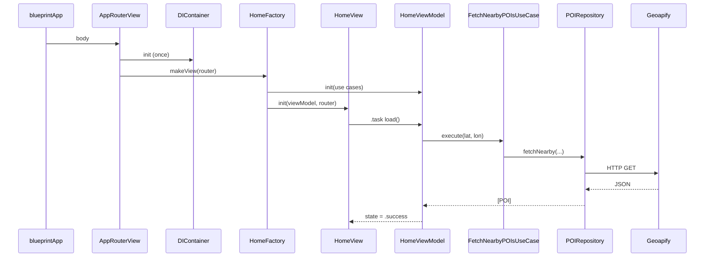

# App Flow

*From cold launch to the Discover list — every step in order.*

This page is a **runtime walkthrough**. It follows the exact sequence of objects and calls when Discover starts, not the theory behind each layer. For that, see [Architecture Overview](/architecture/overview/).

There is no `AppDelegate` here. SwiftUI apps use an `@main` struct conforming to `App`.

## Overview



---

## Step 1 — App entry (`blueprintApp`)

File: `blueprint/blueprintApp.swift`

iOS launches the app and SwiftUI looks for `@main`. Ours is `blueprintApp`:

```swift
@main
struct blueprintApp: App {
    var body: some Scene {
        WindowGroup {
            AppRouterView()
        }
    }
}
```

Nothing else runs yet. No DI, no navigation, no network. The only job is to put `AppRouterView` in the window.

---

## Step 2 — Shell view (`AppRouterView`)

File: `blueprint/Navigation/AppRouterView.swift`

When `AppRouterView` appears, SwiftUI creates its `@State` properties **once**:

```swift
@State private var homeRouter = AppRouter()
@State private var favoritesRouter = AppRouter()
@State private var container = DIContainer()
@Namespace private var zoomNamespace
```

Order matters:

1. **`AppRouter()`** — empty navigation path `[]` for each tab
2. **`DIContainer()`** — wires the entire dependency graph (next step)
3. **`zoomNamespace`** — shared namespace for zoom transition into Detail

Then the body builds a `TabView`:

```swift
TabView {
    discoverTab      // NavigationStack + Home
    if showFavoritesTab { favoritesTab }
}
```

`showFavoritesTab` reads `container.featureFlags.service.isEnabled(.favorites)`. If favorites are off, only the Discover tab shows.

---

## Step 3 — Dependency graph (`DIContainer.init`)

File: `blueprint/DI/DIContainer.swift`

`DIContainer` runs **inside** `AppRouterView`'s `@State`. This is where everything gets connected:

```swift
init() {
    let network = NetworkDependencies()
    let poi = POIDependencies(network: network)
    let location = LocationDependencies()
    let persistence = PersistenceDependencies()
    let featureFlags = FeatureFlagDependencies()

    self.featureFlags = featureFlags
    self.homeFactory = HomeFactory(
        poi: poi, location: location,
        persistence: persistence, featureFlags: featureFlags
    )
    self.detailFactory = DetailFactory(
        persistence: persistence, featureFlags: featureFlags, poi: poi
    )
    self.favoritesFactory = FavoritesFactory(persistence: persistence)
}
```

What each bundle creates:

| Bundle | Creates |
|---|---|
| `NetworkDependencies` | `URLSessionNetworkClient()` |
| `POIDependencies` | `POIRepository`, `PlaceDetailsRepository`, `GeocodingRepository` + their UseCases |
| `LocationDependencies` | `LocationService` |
| `PersistenceDependencies` | SwiftData `ModelContainer`, `FavoritesRepository`, `FavoritesUseCase` |
| `FeatureFlagDependencies` | `FeatureFlagService` |

Example inside `POIDependencies`:

```swift
init(network: NetworkDependencies) {
    let repository = POIRepository(
        client: network.client,
        apiKey: Secrets.geoapifyAPIKey
    )
    self.fetchNearbyPOIs = FetchNearbyPOIsUseCase(repository: repository)
    // fetchPlaceDetails, searchLocation ...
}
```

At the end of this init, `DIContainer` holds three **factories** ready to build screens. No View exists yet.

---

## Step 4 — Navigation stack (Discover tab)

Still in `AppRouterView`, the Discover tab:

```swift
NavigationStack(path: $homeRouter.path) {
    container.homeFactory.makeView(router: homeRouter, namespace: zoomNamespace)
        .navigationDestination(for: AppRoute.self) { route in
            routeDestination(for: route, router: homeRouter)
        }
}
```

Two things happen:

1. **`makeView`** builds the root screen (Home) — next step
2. **`navigationDestination`** registers what to show when `homeRouter.path` gets a new `AppRoute` (e.g. `.detail(poi:)`)

`AppRouter.path` starts as `[]`, so only Home is visible.

---

## Step 5 — Factory builds Home (`HomeFactory.makeView`)

File: `blueprint/DI/Factories/HomeFactory.swift`

```swift
func makeView(router: any RouterProtocol, namespace: Namespace.ID) -> some View {
    let viewModel = HomeViewModel(
        fetchNearbyPOIs: poi.fetchNearbyPOIs,
        searchLocation: poi.searchLocation,
        locationService: location.locationService
    )
    return HomeView(viewModel: viewModel, router: router, namespace: namespace)
}
```

The factory:

1. Creates **`HomeViewModel`** with UseCases and `LocationService` (already wired in Step 3)
2. Returns **`HomeView`** with that ViewModel + router + namespace

The View does not know about `POIRepository` or Geoapify. It only sees the ViewModel.

---

## Step 6 — Home appears (`HomeView`)

File: `blueprint/Presentation/Views/Home/HomeView.swift`

Initial ViewModel state:

```swift
enum HomeUIState {
    case idle       // ← starts here
    case loading
    case success
    case failure(AppError)
}
```

The body is a **`switch viewModel.state`**:

| State | What the user sees |
|---|---|
| `.idle` | `Color.clear` (blank) |
| `.loading` | Skeleton cards |
| `.success` | Scrollable POI list |
| `.failure` | Error message + Try again |

On first appear, `.task` runs:

```swift
.task {
    await viewModel.load()
}
```

`.task` is SwiftUI's "run this async work when the view appears." That kicks off the fetch chain.

---

## Step 7 — ViewModel loads data (`HomeViewModel.load`)

File: `blueprint/Presentation/Views/Home/HomeViewModel.swift`

```swift
func load() async {
    guard case .idle = state else { return }
    await fetch(offset: 0)
}
```

`guard case .idle` prevents refetch when you pop back from Detail (state is already `.success`).

`fetch(offset: 0)` does the real work:

```swift
private func fetch(offset: Int) async {
    if offset == 0 {
        state = .loading          // View switches to skeletons
        visiblePOIs = []
    }

    let coordinates = try await resolveCoordinates()
    let result = try await fetchNearbyPOIs.execute(
        lat: coordinates.latitude,
        lon: coordinates.longitude,
        limit: pageSize,
        offset: offset
    )

    allPOIs = result.items
    visiblePOIs = filtered(allPOIs)
    state = .success              // View switches to list
}
```

### 7a — Coordinates (`resolveCoordinates`)

```swift
private func resolveCoordinates() async throws -> (latitude: Double, longitude: Double) {
    if let last = lastCoordinates { return last }   // user picked a city manually
    let status = await locationService.requestAuthorization()
    guard status == .authorized else {
        return (latitude: -23.5505, longitude: -46.6333)  // São Paulo fallback
    }
    let coords = try await locationService.getCurrentCoordinates()
    return (latitude: coords.latitude, longitude: coords.longitude)
}
```

### 7b — UseCase (`FetchNearbyPOIsUseCase`)

File: `blueprint/Domain/UseCases/FetchNearbyPOIsUseCase.swift`

```swift
func execute(lat: Double, lon: Double, limit: Int, offset: Int = 0) async throws -> PagedResult<POI> {
    let pois = try await repository.fetchNearby(lat: lat, lon: lon, limit: limit, offset: offset)
    return PagedResult(items: pois, hasMore: pois.count == limit)
}
```

Thin wrapper: calls repository, wraps pagination metadata.

### 7c — Repository (`POIRepository.fetchNearby`)

File: `blueprint/Data/Repositories/POIRepository.swift`

1. Check disk cache (first page only)
2. Build Geoapify URL with lat/lon, categories, apiKey
3. `client.data(for: request)` via `NetworkClient`
4. Decode `GeoapifyResponseDTO`
5. Map each feature → Domain `POI`
6. Save to cache, return `[POI]`

ViewModel never sees JSON or URLs.

---

## Step 8 — UI updates

When `state` becomes `.loading`, SwiftUI re-renders `HomeView` → skeleton cards.

When `state` becomes `.success`, the `switch` shows:

```swift
case .success:
    ScrollView {
        LazyVStack {
            ForEach(viewModel.visiblePOIs, id: \.id) { poi in
                Button {
                    router.push(.detail(poi: poi))
                } label: {
                    POICardView(poi: poi)
                }
            }
        }
    }
```

The list is on screen. Cold launch complete.

---

## Step 9 — Tap a POI (navigation)

User taps a card → `router.push(.detail(poi: poi))`.

`AppRouter`:

```swift
func push(_ route: AppRoute) {
    guard path.last != route else { return }
    path.append(route)
}
```

`path` becomes `[.detail(poi: somePOI)]`. SwiftUI's `NavigationStack` pushes the matching destination from `navigationDestination`.

`AppRouterView.routeDestination`:

```swift
case .detail(let poi):
    container.detailFactory.makeView(poi: poi)
```

---

## Step 10 — Detail factory and screen

File: `blueprint/DI/Factories/DetailFactory.swift`

```swift
func makeView(poi: POI) -> some View {
    let viewModel = DetailViewModel(
        poi: poi,
        fetchPlaceDetails: poi.fetchPlaceDetails,
        favorites: persistence.favoritesUseCase,
        featureFlags: featureFlags.service
    )
    return DetailView(viewModel: viewModel)
}
```

`DetailViewModel` starts at `.success(poi)` immediately (basic info from the list). `.task` on Detail calls `loadDetails()` to fetch phone, website, hours asynchronously.

---

## HomeViewModel functions (reference)

| Function | When it runs |
|---|---|
| `load()` | First appear (`.task`), only from `.idle` |
| `refresh()` | Pull to refresh |
| `loadMore()` | Last card appears in list |
| `retry()` | User taps Try again after failure |
| `onSearchQueryChanged()` | Debounced filter on loaded POIs |
| `onLocationQueryChanged()` | Debounced city search |
| `selectLocation(_:)` | User picks a city → refetch at new coordinates |
| `clearLocationSearch()` | Reset to GPS-based fetch |

---

## Files in order (quick map)

```
blueprintApp.swift
  └─ AppRouterView.swift
       ├─ DIContainer.swift
       │    ├─ NetworkDependencies → URLSessionNetworkClient
       │    ├─ POIDependencies → Repository + UseCases
       │    ├─ LocationDependencies → LocationService
       │    ├─ PersistenceDependencies → SwiftData + FavoritesUseCase
       │    └─ HomeFactory / DetailFactory / FavoritesFactory
       ├─ NavigationStack(path: homeRouter.path)
       │    └─ HomeFactory.makeView()
       │         ├─ HomeViewModel
       │         └─ HomeView
       │              └─ .task → load() → UseCase → Repository → Geoapify
       └─ navigationDestination → DetailFactory.makeView(poi:)
```

## Read next

- [Architecture Overview](/architecture/overview/): why these layers exist
- [Dependency Injection](/architecture/dependency-injection/): bundles and factories in depth
- [Navigation](/architecture/navigation/): `AppRoute` and dual stacks
