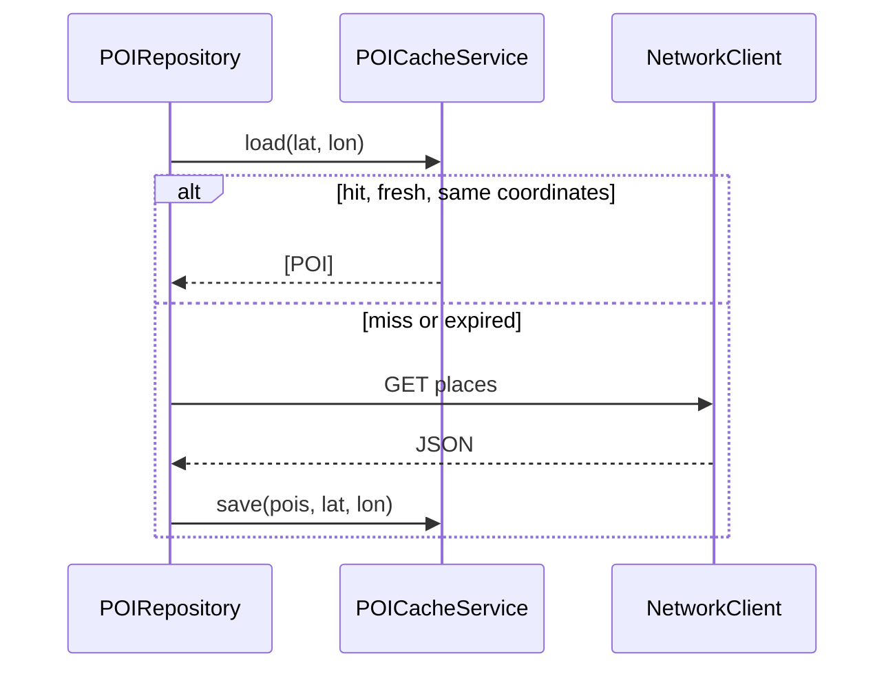

# Why Caching?

Discover refetches nearby POIs from the network unless something short-circuits the call. Without cache, every return to Home costs latency and Geoapify quota.

## What problem does this solve?

Users navigate Home → Detail → Home frequently. Re-downloading the same first page on every visit wastes:

- Network round trips
- API requests (free tier: 3,000/day)
- Battery and time on slow connections

## Why this solution?

`POICacheService` writes JSON to the app caches directory. Entries expire after **300 seconds (5 minutes)**.

Design choices grounded in code:

| Decision | Reason in Blueprint |
|---|---|
| File-backed JSON | Survives process death; simple to inspect |
| TTL 5 minutes | POI lists are not real-time; balances freshness vs quota |
| First page only (`offset == 0`) | Pagination pages are not cached today |
| `@MainActor` class, not `actor` | See [Concurrency](/architecture/concurrency/) |

`POIRepository` owns cache read/write. UseCases and ViewModels are unaware caching exists.

## Alternatives

| Approach | Verdict |
|---|---|
| No cache | Rejected: wastes quota on back navigation |
| `URLCache` on `URLSession` | Rejected: less control over TTL and invalidation |
| In-memory only | Rejected: lost on background kill |
| **`POICacheService` on disk** | Chosen |

## Trade-offs

- **Pro:** Transparent to Domain and Presentation
- **Pro:** Logged via `Logger.cache` (OSLog category)
- **Con:** Stale data up to 5 minutes for the same coordinates
- **Con:** Only first page; `loadMore()` always hits network

## How Blueprint implements it

```swift
// POIRepository.fetchNearby
if offset == 0, let cached = cache.load(lat: lat, lon: lon) {
    return cached
}
// ... network ...
cache.save(pois, lat: lat, lon: lon)
```

`CacheEntry` stores `[POI]`, coordinates, and `savedAt`. Load rejects expired entries and entries whose coordinates do not match the current request.



## Related code

- `blueprint/Data/Cache/POICacheService.swift`
- `blueprint/Data/Repositories/POIRepository.swift`
- `blueprint/Core/Logging/AppLogger.swift`

## Further reading

- [Networking](/architecture/networking/)
- [Performance](/architecture/performance/)
- [Repository Pattern](/architecture/repository/)
