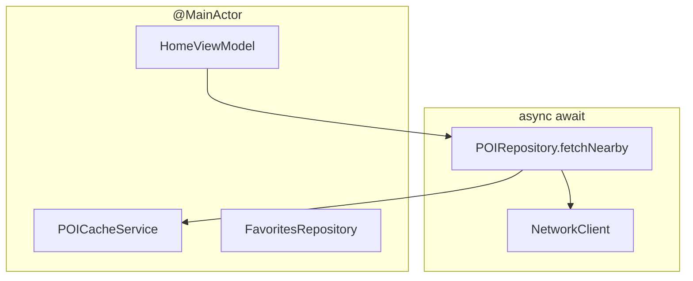

# Why Concurrency Matters Here?

Discover is async-native: network repositories, CoreLocation, and SwiftUI all cross thread boundaries. Blueprint picks **Swift Concurrency** over GCD or Combine callbacks.

## What problem does this solve?

Without explicit isolation:

- UI updates from background threads crash or warn
- Debounce timers leak or fire after deallocation
- Shared mutable cache state races between calls

## Why this solution?

Blueprint uses a **small, consistent toolkit** that matches the actual codebase:

| Tool | Where |
|---|---|
| `@MainActor` | ViewModels, `AppRouter`, `DIContainer`, `FavoritesRepository`, `POICacheService` |
| `async/await` | Repository methods, ViewModel `load()` / `fetch()` |
| `Task` + cancellation | Search debounce in `HomeViewModel` |
| `Sendable` | UseCase protocols, `FeatureFlagServiceProtocol`, Domain entities |
| `SWIFT_DEFAULT_ACTOR_ISOLATION = MainActor` | Xcode build setting on app target |

**Not used today:** standalone `actor` types. `POICacheService` is `@MainActor final class` because default actor isolation already main-threads the module; a separate `actor` would force `nonisolated` on helpers without measurable gain for file I/O this small.

## Alternatives

| Approach | Verdict |
|---|---|
| Completion handlers | Rejected: pyramid code in ViewModels |
| Combine pipelines | Rejected for domain flow; not used in ViewModels |
| DispatchQueue.main.async | Rejected: `@MainActor` is clearer |
| **`async/await` + `@MainActor`** | Chosen |

## Trade-offs

- **Pro:** Readable linear flow in `HomeViewModel.fetch`
- **Pro:** `Task.isCancelled` guards debounce work
- **Pro:** Compiler enforces main-actor UI types
- **Con:** `@MainActor` on repositories ties SwiftData access to main thread
- **Con:** Easy to over-mark types; Blueprint keeps UseCases as lightweight structs

## How Blueprint implements it

**Debounced search** (`HomeViewModel.onSearchQueryChanged`):

```swift
searchTask?.cancel()
searchTask = Task {
    try? await Task.sleep(for: .milliseconds(300))
    guard !Task.isCancelled else { return }
    visiblePOIs = filtered(allPOIs)
}
```

**Async repository boundary**

```swift
func fetchNearby(lat:lon:limit:offset:) async throws -> [POI]
```

**Location**

`LocationService` wraps `CLLocationManager` with async authorization and coordinate fetch.



## Related code

- `blueprint/Presentation/Views/Home/HomeViewModel.swift`
- `blueprint/Data/Cache/POICacheService.swift`
- `blueprint/Data/Location/LocationService.swift`
- `blueprint/Data/Repositories/POIRepository.swift`
- `blueprint/DI/DIContainer.swift`
- `blueprint.xcodeproj/project.pbxproj` (`SWIFT_DEFAULT_ACTOR_ISOLATION`)

## Further reading

- [Caching](/architecture/caching/)
- [MVVM](/architecture/mvvm/)
- [Testing](/architecture/testing/)
