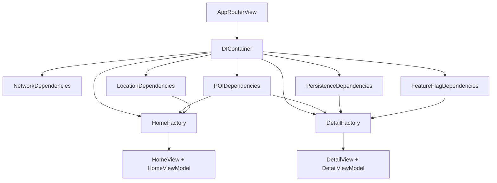

# Why Dependency Injection?

Discover's object graph spans networking, three repositories, four use cases, location, SwiftData, and feature flags. Without DI, constructors become untraceable and tests cannot swap implementations.

## What problem does this solve?

Hidden singletons and service locators make dependencies implicit. A ViewModel can reach for `URLSession.shared` or a global `ModelContext` without declaring it in `init`.

Blueprint needs **explicit graphs** that compile and are easy to jump through in Xcode.

## Why this solution?

`DIContainer` (@MainActor, one instance in `AppRouterView`) builds:

1. **Bundles** group dependencies by concern
2. **Factories** create screen ViewModels + Views
3. **Protocols** at every boundary for tests

No Swinject, no property wrappers, no runtime resolution.

## Alternatives

| Approach | Verdict |
|---|---|
| Swinject / Factory | Rejected: opaque runtime graph |
| Service locator | Rejected: hidden dependencies |
| Manual init chains in Views | Rejected: does not scale |
| **DIContainer + bundles + factories** | Chosen |

## Trade-offs

- **Pro:** Entire graph visible in one place
- **Pro:** Bundles prevent 200-line container files
- **Pro:** Factories encapsulate per-screen wiring
- **Con:** New screen = new factory method
- **Con:** `@MainActor` container matches UI lifecycle but tests must run on main actor

## How Blueprint implements it

**Bundles**

| Bundle | Provides |
|---|---|
| `NetworkDependencies` | `URLSessionNetworkClient` |
| `POIDependencies` | POI, place details, geocoding use cases |
| `LocationDependencies` | `LocationService` |
| `PersistenceDependencies` | `FavoritesUseCase`, `ModelContainer` |
| `FeatureFlagDependencies` | `LocalFeatureFlagService` |

**Factories**

| Factory | Creates |
|---|---|
| `HomeFactory` | `HomeView` + `HomeViewModel` |
| `DetailFactory` | `DetailView` + `DetailViewModel` |

## Related code

- `blueprint/DI/DIContainer.swift`
- `blueprint/DI/Core/NetworkDependencies.swift`
- `blueprint/DI/Core/POIDependencies.swift`
- `blueprint/DI/Core/LocationDependencies.swift`
- `blueprint/DI/Core/PersistenceDependencies.swift`
- `blueprint/DI/Core/FeatureFlagDependencies.swift`
- `blueprint/DI/Factories/HomeFactory.swift`
- `blueprint/DI/Factories/DetailFactory.swift`
- `blueprintTests/DIContainerTests.swift`

## Further reading

- [ADR 0003: Dependency Injection](/decisions/0003-dependency-injection/)
- [MVVM](/architecture/mvvm/)
- [Testing](/architecture/testing/)
