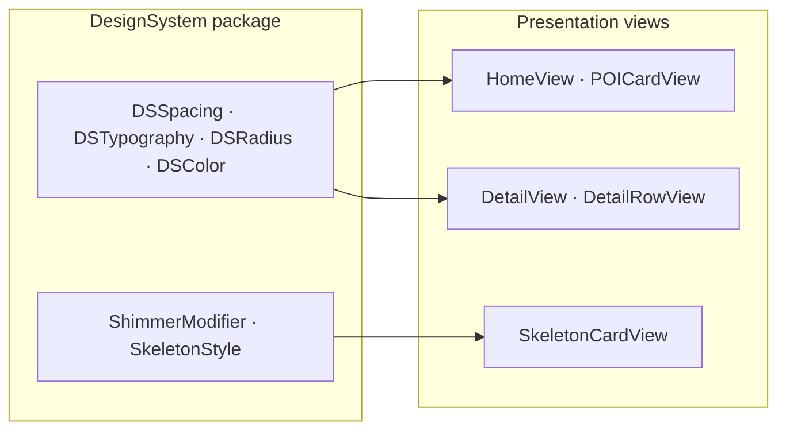

# Design System

## The problem

Magic numbers scattered across views (`padding(16)`, `.font(.system(size: 17))`) diverge over time and break Dynamic Type.

## Why a Swift Package

Tokens in a dedicated package expose a small public API, prevent the app target from becoming a UI constants dump, and can be previewed independently.

## Alternatives considered

| Approach | Verdict |
|---|---|
| Extensions on `CGFloat` | No compile boundary |
| Asset catalog colors only | No spacing/typography |
| **Local Swift Package** | ✅ Chosen |

## Trade-offs

- **Pro:** Single source of truth for visual language
- **Pro:** Semantic tokens scale with Dynamic Type
- **Con:** Extra package to maintain for a small app

## How Blueprint implements it

| Token | Purpose |
|---|---|
| `DSSpacing` | Padding and gaps |
| `DSTypography` | Semantic font styles |
| `DSRadius` | Corner radii |
| `DSColor` | Semantic colors |

`SkeletonCardView` and `ShimmerModifier` live here as reusable loading primitives.

- `Packages/DesignSystem/Sources/DesignSystem/Tokens/`
- `Packages/DesignSystem/Sources/DesignSystem/Modifiers/ShimmerModifier.swift`

## Further reading

- [Accessibility](/architecture/accessibility/)
