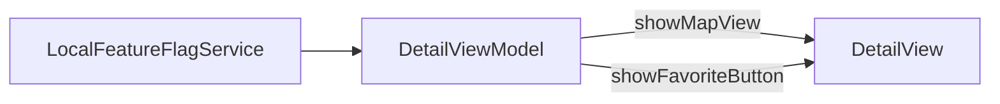

# Why Feature Flags?

Some Discover capabilities should ship in code but stay **off until validated**: map on Detail, category filters, favorites UI.

## What problem does this solve?

Hardcoded `#if DEBUG` or string flag names (`"show_map"`) cause:

- Typos discovered at runtime
- No single place to toggle behavior
- App Store release required to disable a broken feature (without Remote Config)

## Why this solution?

**Typed enum** + **protocol-backed service**:

```swift
enum FeatureFlag: String {
    case favorites
    case mapView
    case categoryFilter
}

protocol FeatureFlagServiceProtocol: Sendable {
    func isEnabled(_ flag: FeatureFlag) -> Bool
}
```

`LocalFeatureFlagService` holds defaults in code. Views and ViewModels read flags at init through injected `FeatureFlagServiceProtocol`.

Remote Config is not implemented yet. The protocol exists so the backend can be swapped later.

## Alternatives

| Approach | Verdict |
|---|---|
| `#if DEBUG` only | Rejected: cannot toggle in production builds |
| String keys | Rejected: not compile-time safe |
| **Enum + protocol** | Chosen |

## Trade-offs

- **Pro:** Compiler-checked flag names
- **Pro:** Swap `LocalFeatureFlagService` for Remote Config without View changes
- **Con:** Local backend requires **rebuild** to change flags (no runtime debug menu)
- **Con:** `.categoryFilter` reserved but not wired in UI yet

## How to toggle a flag

There is no in-app settings screen. Flags live in source:

1. Open `blueprint/Data/FeatureFlags/FeatureFlagService.swift`
2. Edit `LocalFeatureFlagService.flags`:

```swift
private let flags: [FeatureFlag: Bool] = [
    .favorites: true,
    .mapView: true,        // set false to hide map on Detail
    .categoryFilter: false
]
```

3. Rebuild and run (⌘R)

## What is wired today

| Flag | Default | Effect when `true` |
|---|---|---|
| `.favorites` | `true` | Favorite button on Detail screen |
| `.mapView` | `true` | `POIMapView` section on Detail |
| `.categoryFilter` | `false` | **Not wired** (enum + DI only) |

**Try the map:** map is on by default. Set `.mapView: false` and rebuild to hide it.

**Hide favorites:** set `.favorites: false`, rebuild. The heart button disappears.

## How flags reach the UI

```
FeatureFlagDependencies
  └── LocalFeatureFlagService
        └── DetailFactory
              └── DetailViewModel (reads .favorites, .mapView at init)
                    └── DetailView (showFavoriteButton, showMapView)
```

`HomeFactory` receives `FeatureFlagDependencies` for future Home flags (e.g. `.categoryFilter`). Not used yet.



## Related code

- `blueprint/Data/FeatureFlags/FeatureFlag.swift`
- `blueprint/Data/FeatureFlags/FeatureFlagService.swift`
- `blueprint/DI/Core/FeatureFlagDependencies.swift`
- `blueprint/Presentation/Views/Detail/DetailViewModel.swift`
- `blueprint/Presentation/Views/Detail/DetailView.swift`

## Further reading

- [Future Directions: Remote Config](/guides/future-directions/)
- [Dependency Injection](/architecture/dependency-injection/)
