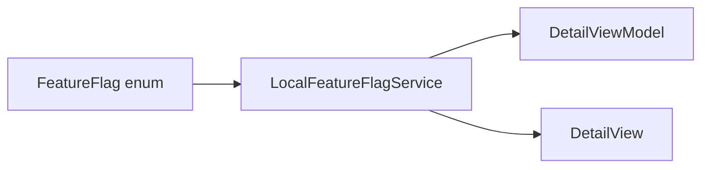

# Why Feature Flags?

Some Discover capabilities should ship in code but stay **off or gradual** until validated: map on Detail, category filters, favorites UI.

## What problem does this solve?

Hardcoded `#if DEBUG` or string flag names (`"show_map"`) cause:

- Typos discovered at runtime
- No single place to toggle behavior
- App Store release required to disable a broken feature

## Why this solution?

**Typed enum** + **protocol-backed service**:

```swift
enum FeatureFlag: String {
    case favorites
    case mapView
    case categoryFilter
}

protocol FeatureFlagServiceProtocol: Sendable {
    func isEnabled(_ flag: FeatureFlag) -> Bool
}
```

`LocalFeatureFlagService` holds defaults in a dictionary. `DetailViewModel` reads `.favorites` at init. `DetailView` reads `.mapView` for `POIMapView`.

No Remote Config in the repo today, but the protocol slot is ready.

## Alternatives

| Approach | Verdict |
|---|---|
| `#if DEBUG` only | Rejected: cannot toggle in production builds |
| String keys | Rejected: not compile-time safe |
| **Enum + protocol** | Chosen |

## Trade-offs

- **Pro:** Compiler-checked flag names
- **Pro:** Swap `LocalFeatureFlagService` for Remote Config without View changes
- **Pro:** `Sendable` protocol fits async call sites
- **Con:** Local backend requires rebuild to change defaults
- **Con:** `.categoryFilter` reserved but not wired in UI yet

## How Blueprint implements it

**Current defaults** (`LocalFeatureFlagService`):

| Flag | Default | Used in |
|---|---|---|
| `.favorites` | `true` | `DetailViewModel.showFavoriteButton` |
| `.mapView` | `false` | `DetailView` map section |
| `.categoryFilter` | `false` | Not wired yet |

Wired through `FeatureFlagDependencies` → `DetailFactory` / `HomeFactory` as needed.



## Related code

- `blueprint/Data/FeatureFlags/FeatureFlag.swift`
- `blueprint/Data/FeatureFlags/FeatureFlagService.swift`
- `blueprint/DI/Core/FeatureFlagDependencies.swift`
- `blueprint/Presentation/Views/Detail/DetailViewModel.swift`
- `blueprint/Presentation/Views/Detail/DetailView.swift`

## Further reading

- [Dependency Injection](/architecture/dependency-injection/)
- [MVVM](/architecture/mvvm/)
