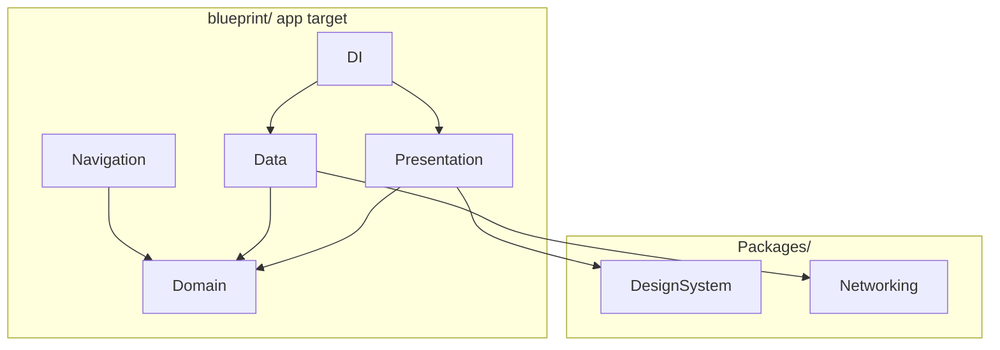

# Why Modularization?

Blueprint teaches architecture with **real boundaries**, not folder conventions. Local Swift Packages make illegal imports a compile error.

## What problem does this solve?

In a single app target, any file can `import` anything. Domain types start referencing SwiftUI. DTOs appear in ViewModels. Code review becomes the only guardrail.

## Why this solution?

Swift Package Manager modules in `Packages/`:

| Package | Exports | Cannot import |
|---|---|---|
| `DesignSystem` | Tokens, shimmer modifier | App target |
| `Networking` | `NetworkClient`, `URLSessionNetworkClient` | App target |

The **app target** owns features that cross-cut layers: Navigation (needs `POI`), DI (wires everything), Presentation screens.

## Alternatives

| Approach | Verdict |
|---|---|
| Single target | Rejected: no enforcement |
| Xcode dynamic frameworks | Rejected: heavier than SPM for two modules |
| **Local Swift Packages** | Chosen |

## Trade-offs

- **Pro:** Compiler enforces dependency direction
- **Pro:** Packages reusable for widgets/extensions later
- **Pro:** Faster incremental builds as packages grow
- **Con:** More Xcode targets to manage
- **Con:** Navigation and DI stay monolithic in app target by design

## How Blueprint implements it

```
Packages/
├── DesignSystem/     DSSpacing, DSTypography, DSColor, DSRadius, SkeletonStyle
└── Networking/       NetworkClient protocol, URLSessionNetworkClient, NetworkError

App target (blueprint/)
├── Domain/           No SwiftUI, SwiftData, or Geoapify imports
├── Data/             Imports Domain + Networking
├── Presentation/     Imports Domain + DesignSystem
├── Navigation/       Imports Domain
└── DI/               Imports all layers to assemble graph
```



## Related code

- `Packages/DesignSystem/`
- `Packages/Networking/`
- `blueprint/Domain/`
- `blueprint/Data/`

## Further reading

- [ADR 0001: Modularization](/decisions/0001-modularization/)
- [Design System](/architecture/design-system/)
- [Networking](/architecture/networking/)
