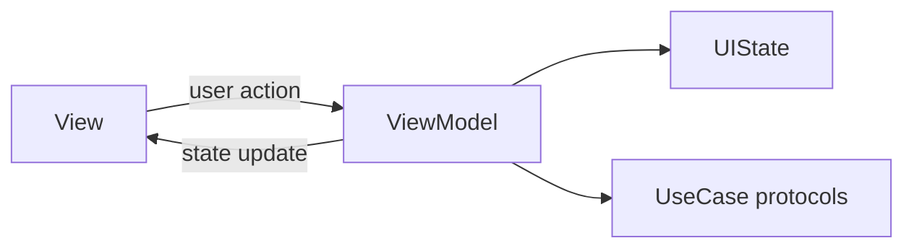

# MVVM

*How I split screens into View + ViewModel in Discover.*

**MVVM** = Model · View · ViewModel.

| Piece | In Discover |
|---|---|
| **Model** | Domain data the screen shows (`POI`, `AppError`) |
| **View** | SwiftUI (`HomeView`) |
| **ViewModel** | Screen state + actions (`HomeViewModel`) |

## How I use it

Views stay declarative: they read ViewModel state and forward taps.

Each ViewModel holds:

- `@Observable` properties the View binds to
- `HomeUIState` / `DetailUIState` (idle, loading, success, failure)
- Calls to UseCase protocols
- Calls to `RouterProtocol` for navigation

Business rules sit in UseCases. HTTP and DTOs sit in Repositories. The ViewModel coordinates the screen.

```swift
enum HomeUIState: Equatable {
  case idle
  case loading
  case success([POI])
  case failure(AppError)
}
```

ViewModels are `@MainActor` + `@Observable` (iOS 17).

| Screen | View | ViewModel |
|---|---|---|
| Home | `HomeView` | `HomeViewModel` |
| Favorites | `FavoritesView` | `FavoritesViewModel` |
| Detail | `DetailView` | `DetailViewModel` |

## Wiring

Factories assemble ViewModels. Views never construct repositories or use cases themselves.



`HomeFactory` and `DetailFactory` live in `DI/`. See [Dependency Injection](/architecture/dependency-injection/).

### What I did

One ViewModel per screen, UIState enum per screen, no Repository calls from Views.

### Why (then)

I wanted screen state and UseCase calls in types I could test without SwiftUI, and the same shape on Home, Favorites, and Detail so I did not reinvent the pattern each time.

### What I'd reconsider

`HomeViewModel` grew (pagination, debounced search, location picker). I might extract sub-ViewModels or move more logic into UseCases if I add features. The ViewModel is a coordinator, not a junk drawer forever.

## Could I use MV instead?

**MV** = Model + View only. No ViewModel type. In SwiftUI, often `@State` + `.task { }` with fetch logic in the View or in extensions.

Discover could be built that way. Large production apps use MV too (extracted subviews, extensions, UseCases behind the scenes).

I picked ViewModels here for testability and consistency across three screens. On a one-screen experiment I would probably skip them.

## Could I use VIPER instead?

**VIPER** splits each screen into View, Interactor, Presenter, Entity, and Router. More roles, more files; teams that commit to the ceremony get strong boundaries.

Discover maps loosely to VIPER:

| VIPER | Blueprint |
|---|---|
| View | SwiftUI View |
| Presenter | ViewModel |
| Interactor | UseCase |
| Entity | Domain struct |
| Router | `RouterProtocol` + `AppRoute` |

I stopped short of full VIPER: fewer types per screen, no separate Presenter/Interactor file pair on every feature. Lighter to browse in Xcode for a study repo. I might go fuller VIPER if the team already standardized on it.

Navigation detail: [Navigation](/architecture/navigation/).

## Read next

- [Domain](/architecture/domain/): UseCases and entities
- [Dependency Injection](/architecture/dependency-injection/): factories wire ViewModels
