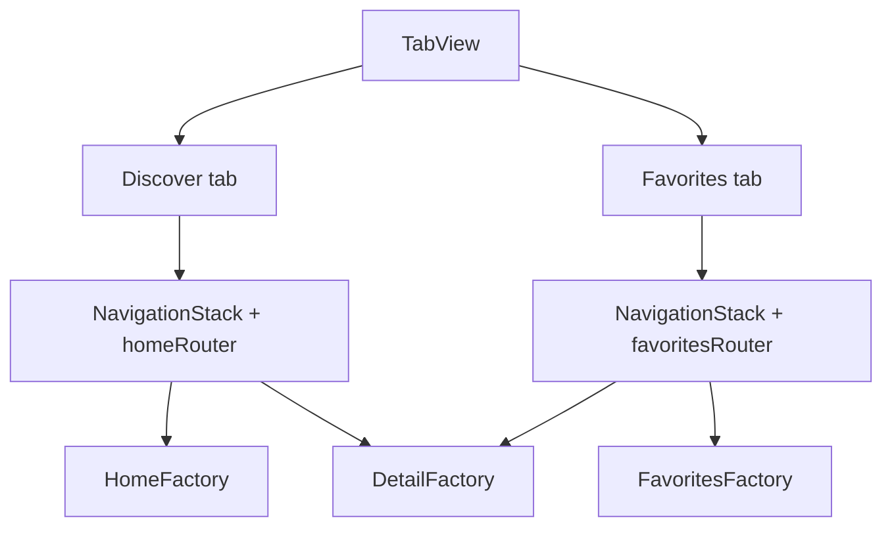

# Why Navigation?

Discover has three primary destinations: **Home**, **Favorites**, and **Detail(POI)**. Navigation must be type-safe, testable, and owned outside individual views.

## What problem does this solve?

Views that mutate `NavigationPath` directly are hard to unit test and tightly coupled to SwiftUI APIs. ViewModels that know about `NavigationStack` cannot run in isolation.

## Why this solution?

| Piece | Role |
|---|---|
| `AppRoute` | Hashable enum: `.home`, `.detail(poi:)` |
| `AppRouter` | `@Observable` holder of `path: [AppRoute]` |
| `RouterProtocol` | ViewModels call `push` / `pop` / `popToRoot` |
| `AppRouterView` | Root `TabView` + per-tab `NavigationStack`, injects container + routers |

ViewModels depend on `any RouterProtocol`, not `AppRouter`.

## Alternatives

| Approach | Verdict |
|---|---|
| UIKit Coordinator | Rejected: heavy in SwiftUI-first app |
| EnvironmentObject router | Rejected: implicit, harder to mock |
| Untyped `[Hashable]` routes | Rejected: loses compile-time POI payload |
| Single stack with modal favorites | Rejected: no dedicated list to browse saved places |
| **TabView + NavigationStack per tab + AppRoute** | Chosen |

## Trade-offs

- **Pro:** Compiler validates route payloads (`POI` in `.detail`)
- **Pro:** Router tested/mocked independently
- **Pro:** `@Observable` router, no Combine
- **Con:** Lives in app target (references Domain types)
- **Con:** Zoom transitions require extra `Namespace` wiring in factory
- **Con:** Each tab owns its own `AppRouter` instance (independent back stacks)

## How Blueprint implements it

`HomeViewModel` and `FavoritesViewModel` push `.detail(poi:)` through injected router.

`AppRouterView` hosts a `TabView`. Discover and Favorites each get their own `NavigationStack` and `AppRouter`, so back navigation stays scoped per tab. Factories build screen roots and Detail destinations.

iOS 18 zoom transition: `HomeFactory` receives `Namespace.ID` for matched geometry between list and detail on the Discover tab.

## Related code

- `blueprint/Navigation/AppRoute.swift`
- `blueprint/Navigation/AppRouter.swift`
- `blueprint/Navigation/RouterProtocol.swift`
- `blueprint/Navigation/AppRouterView.swift`
- `blueprint/Presentation/Views/Favorites/FavoritesView.swift`
- `blueprint/Presentation/Views/Components/ZoomTransitionModifier.swift`

## Further reading

- [ADR 0002: Navigation](/decisions/0002-navigation/)
- [Observation](/architecture/observation/)
- [MVVM](/architecture/mvvm/)
