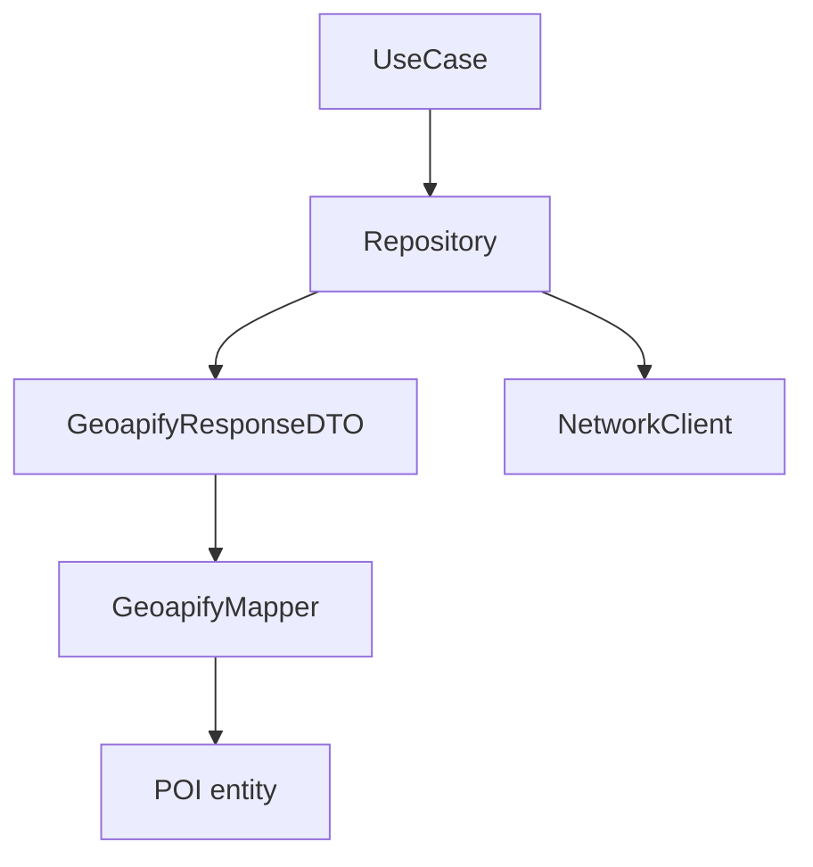

# Why Networking This Way?

Geoapify returns JSON. Domain works with `POI` structs. Something in between must decode, validate, and map without leaking API details upward.

## What problem does this solve?

When ViewModels decode JSON:

- Field renames break Presentation
- Tests require recorded HTTP responses in ViewModel tests
- Second API source duplicates URL logic

Blueprint treats HTTP as **infrastructure**, not domain knowledge.

## Why this solution?

Layers in code:

1. **`NetworkClient`** protocol in `Packages/Networking/`
2. **`URLSessionNetworkClient`** default implementation with OSLog
3. **DTOs** in `blueprint/Data/DTO/` mirror Geoapify JSON
4. **Mappers** produce Domain entities
5. **Repositories** build URLs, call client, map results

ViewModels never import `Networking` or know endpoint paths.

## Alternatives

| Approach | Verdict |
|---|---|
| URLSession in ViewModel | Rejected |
| `Codable` on `POI` | Rejected: API owns Domain shape |
| Alamofire / generated client | Rejected: extra dependency for teaching project |
| **Protocol client + DTO + Repository** | Chosen |

## Trade-offs

- **Pro:** Domain stable when Geoapify schema shifts
- **Pro:** `MockPOIRepository` avoids HTTP in ViewModel tests
- **Pro:** `NetworkClient` shared across three repositories
- **Con:** Many small DTO structs per endpoint family
- **Con:** URL construction duplicated per repository (acceptable at this scale)

## How Blueprint implements it

**Repositories using `NetworkClient` today**

| Repository | Geoapify endpoint |
|---|---|
| `POIRepository` | `/v2/places` |
| `PlaceDetailsRepository` | `/v2/place-details` |
| `GeocodingRepository` | `/v1/geocode/search` |

**Call chain**

```
HomeViewModel → FetchNearbyPOIsUseCase → POIRepository → NetworkClient
                                              ↓
                                        GeoapifyMapper → POI
```

API key comes from `Secrets.geoapifyAPIKey` (injected at repository init via `POIDependencies`), not hardcoded in source.



## Related code

- `Packages/Networking/Sources/Networking/NetworkClient.swift`
- `Packages/Networking/Sources/Networking/URLSessionNetworkClient.swift`
- `blueprint/Data/Repositories/POIRepository.swift`
- `blueprint/Data/Repositories/PlaceDetailsRepository.swift`
- `blueprint/Data/Repositories/GeocodingRepository.swift`
- `blueprint/Data/DTO/GeoapifyMapper.swift`
- `blueprintTests/GeoapifyMapperTests.swift`

## Further reading

- [Repository Pattern](/architecture/repository/)
- [Caching](/architecture/caching/)
- [API Key Setup](/guides/api-key-setup/)
