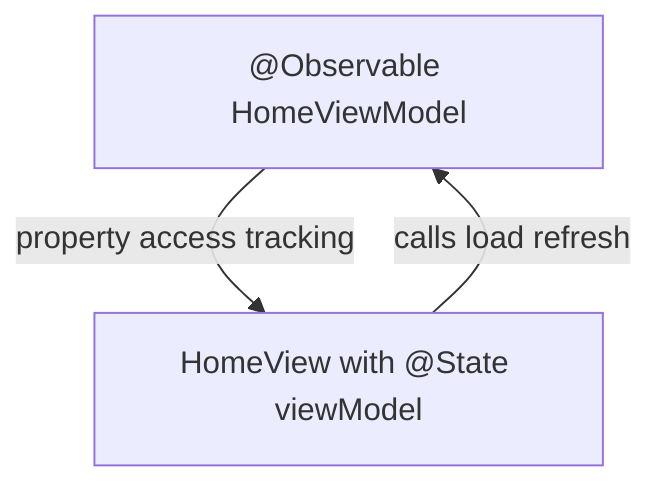

# Why Observation?

Blueprint uses Swift's **`@Observable` macro** (iOS 17+) for reference-type state holders: ViewModels and the app router.

## What problem does this solve?

`ObservableObject` + `@Published` + Combine adds ceremony:

- Every property that drives UI needs `@Published`
- Views need `@ObservedObject` or `@StateObject`
- Routers and ViewModels import Combine

For a project teaching modern SwiftUI, that is noise without benefit at iOS 17+.

## Why this solution?

`@Observable` tracks property access automatically. Views hold `@State var viewModel` and SwiftUI diffing updates only affected regions.

Blueprint applies it consistently:

| Type | File |
|---|---|
| `HomeViewModel` | Presentation |
| `DetailViewModel` | Presentation |
| `AppRouter` | Navigation |

All remain `@MainActor` because UI state must publish on the main thread.

## Alternatives

| Approach | Verdict |
|---|---|
| `@Observable` | Chosen for ViewModels and router |
| `ObservableObject` | Legacy; not needed at iOS 17 minimum |
| Value-type `@State` in View | Fine for local toggles; not for injected screen logic |
| `@Bindable` wrapper | Used where two-way binding to ViewModel properties is needed |

## Trade-offs

- **Pro:** Less boilerplate, no Combine import in ViewModels
- **Pro:** Same macro for router and screens
- **Con:** iOS 17+ only (aligned with project deployment target)
- **Con:** Team must learn `@State` vs `@Bindable` rules for `@Observable` types

## How Blueprint implements it

```swift
@MainActor
@Observable
final class HomeViewModel {
    private(set) var state: HomeUIState = .idle
    var searchQuery: String = ""
    // ...
}
```

`AppRouter` mirrors the pattern with a `path: [AppRoute]` property that `AppRouterView` binds into `NavigationStack`.

Views observe changes without `objectWillChange.send()`.



## Related code

- `blueprint/Presentation/Views/Home/HomeViewModel.swift`
- `blueprint/Presentation/Views/Detail/DetailViewModel.swift`
- `blueprint/Navigation/AppRouter.swift`
- `blueprint/Navigation/AppRouterView.swift`

## Further reading

- [ADR 0004: Observable State](/decisions/0004-observable-state/)
- [MVVM](/architecture/mvvm/)
- [Navigation](/architecture/navigation/)
