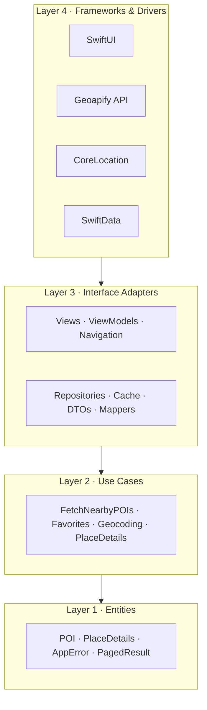
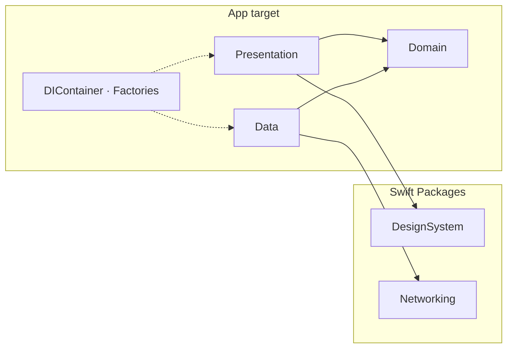
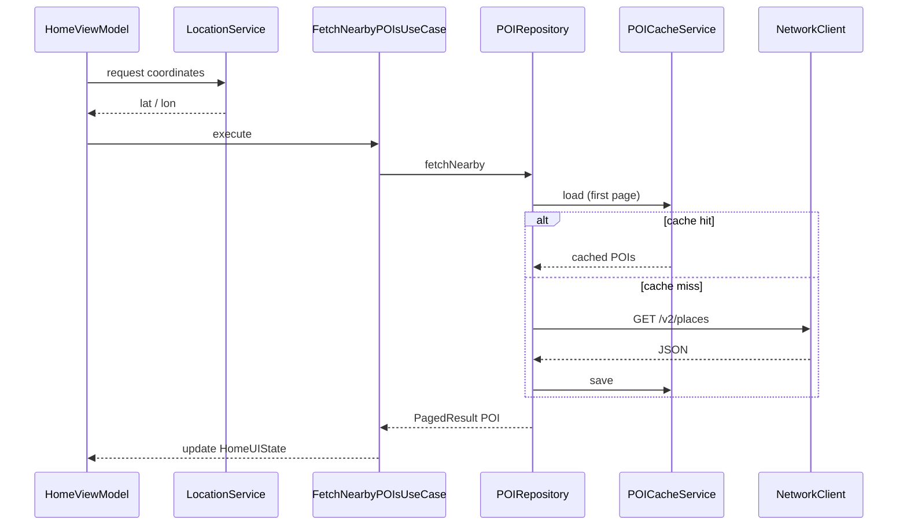
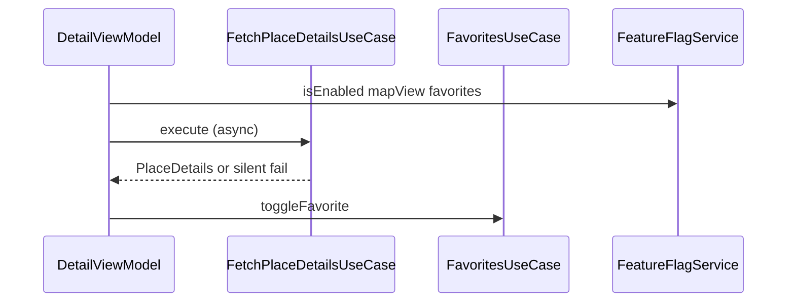

# Architecture Overview (Clean Architecture)

Discover is a places app: it lists **POIs** (Points of Interest, such as restaurants and museums) near the user. New to the product vocabulary? Read [About Discover](/guides/about-discover/) before the layers below.

Discover is structured in layers. Dependencies point inward: outer layers depend on inner layers, never the reverse.

**Dependency rule:** Presentation and Data both talk to Domain. Domain imports nothing from SwiftUI, Geoapify, or SwiftData.

## UI Layer (SwiftUI)

**Navigation**

- `AppRouter`, `AppRouterView`
- `AppRoute` enum (`.home`, `.detail(poi:)`)
- `RouterProtocol` for testable navigation from ViewModels

**Views**

- `HomeView`: POI list, search, pagination, skeleton loading
- `FavoritesView`: saved POIs, swipe to remove, navigation to Detail
- `DetailView`: place details, favorites, optional map
- `LocationSearchView`: city search overlay

**Components**

- `POICardView`, `SkeletonCardView`, `DetailRowView`
- `AnimatedFavoriteButton`, `POIMapView`
- `ZoomTransitionModifier` (iOS 18 zoom navigation)

**Design System** (local Swift Package)

- Spacing: `DSSpacing` (4pt to 48pt scale)
- Typography: `DSTypography` (Dynamic Type aware)
- Radius: `DSRadius`
- Color: `DSColor` (category semantic colors)
- Skeleton: `SkeletonStyle`, `ShimmerModifier`

## Presentation Layer

**ViewModels**

- `HomeViewModel`
- `FavoritesViewModel`
- `DetailViewModel`

Both are `@MainActor` and `@Observable`. ViewModels call UseCases only, never Repositories directly.

**UIState**

- `HomeUIState`: `.idle`, `.loading`, `.success`, `.failure`
- `DetailUIState`: same shape, success carries the selected `POI`

## Domain Layer

**Use Cases**

| Use Case | Responsibility |
|---|---|
| `FetchNearbyPOIsUseCase` | Paginated nearby POIs for coordinates |
| `FetchPlaceDetailsUseCase` | Extended place data by Geoapify ID |
| `SearchLocationUseCase` | City geocoding for manual location |
| `FavoritesUseCase` | Add, remove, and query favorite POIs |

**Entities**

- `POI`, `PlaceDetails`, `GeocodingResult`
- `PlaceCategory`, `PagedResult<T>`, `AppError`

**Interfaces (Protocols)**

- `POIRepositoryProtocol`, `PlaceDetailsRepositoryProtocol`, `GeocodingRepositoryProtocol`
- `FavoritesRepositoryProtocol`
- `LocationServiceProtocol`, `FeatureFlagServiceProtocol`
- `NetworkClient` (Networking package)

## Data Layer

**Repositories**

| Repository | Backend |
|---|---|
| `POIRepository` | Geoapify Places API + `POICacheService` |
| `PlaceDetailsRepository` | Geoapify Place Details API |
| `GeocodingRepository` | Geoapify Geocoding API |
| `FavoritesRepository` | SwiftData (`FavoritePOI` model) |

**Infrastructure**

- **Network:** `URLSessionNetworkClient` (Networking package)
- **Cache:** `POICacheService` (file-backed JSON, 5-minute TTL, first page only)
- **Location:** `LocationService` (CoreLocation wrapper)
- **Feature flags:** `LocalFeatureFlagService` (in-memory, swappable to Remote Config)

**DTOs and mappers**

Geoapify JSON decodes into Data-layer DTOs. Mappers produce Domain entities. ViewModels never see API field names.

## External Systems

| System | Used for |
|---|---|
| [Geoapify Places API](https://www.geoapify.com/) | Nearby POIs (restaurants, museums, parks, hotels) |
| Geoapify Place Details API | Phone, website, opening hours |
| Geoapify Geocoding API | City search when GPS is unavailable |
| CoreLocation | Current coordinates and permission handling |
| SwiftData | Favorite POIs persisted on device |

Free tier: 3,000 requests/day, no credit card required.

## API Keys

API keys are not hardcoded in source.

1. Developer copies `Config.xcconfig.sample` to `Config.xcconfig`
2. `GEOAPIFY_API_KEY` flows through build settings into `Supporting/Info.plist`
3. Runtime reads `Bundle.main` via `Secrets.geoapifyAPIKey`

See [API Key Setup](/guides/api-key-setup/) for the full walkthrough.

## Key Features

### 1) Nearby POIs using GPS

The app requests location permission and reads coordinates through `LocationService`. `HomeViewModel` passes them to `FetchNearbyPOIsUseCase`, which calls `POIRepository`.

If permission is denied, the simulator defaults to São Paulo. Users can also search for a city manually.

### 2) Geoapify integration with cache

`POIRepository` hits Geoapify only on cache miss. `POICacheService` stores the first page on disk with a 5-minute TTL so navigating back to Home does not refetch.

### 3) Place details on demand

`DetailViewModel` loads extended details asynchronously. Failure is silent: the basic POI from the list still renders.

### 4) Favorites with SwiftData

`FavoritePOI` is a `@Model` in the Data layer. `FavoritesRepository` maps between `FavoritePOI` and Domain `POI`. Domain never imports SwiftData.

The **Favorites tab** lists saved places via `FavoritesUseCase.fetchAll()`. Swipe to remove reuses the same `toggle` operation as Detail. Tapping a row opens Detail through the same `AppRoute.detail(poi:)` used on Home.

### 5) Feature flags

`FeatureFlag` enum with typed cases (`.favorites`, `.mapView`, `.categoryFilter`). `FeatureFlagServiceProtocol` allows swapping local defaults for Remote Config later without changing Views.

### 6) Design System in a Swift Package

Centralized tokens keep spacing, typography, and colors consistent. Presentation imports `DesignSystem`; the package imports nothing from the app target.

### 7) Skeleton loading

`SkeletonCardView` and `ShimmerModifier` replace bare `ProgressView` spinners. Layout stays stable while data loads.

## Data Flow (High Level)

**Home**

1. `LocationService` resolves coordinates
2. `FetchNearbyPOIsUseCase` calls `POIRepository`
3. Repository checks cache, then Geoapify if needed
4. Mapper produces `[POI]`; ViewModel updates `HomeUIState`

**Detail**

1. `DetailViewModel` receives `POI` from navigation
2. `FetchPlaceDetailsUseCase` loads extended data
3. `FavoritesUseCase` reads/writes SwiftData through the repository
4. Feature flags gate map view and favorite button

**Search**

1. User types a city in `LocationSearchView`
2. Debounced `SearchLocationUseCase` calls `GeocodingRepository`
3. Selected result updates the coordinate used for POI fetch

## Dependency Injection

`DIContainer` is the root assembler. It wires five bundles and two factories:

| Bundle | Provides |
|---|---|
| `NetworkDependencies` | `NetworkClient` |
| `POIDependencies` | POI, place details, and geocoding use cases |
| `LocationDependencies` | `LocationService` |
| `PersistenceDependencies` | `FavoritesUseCase`, `ModelContainer` |
| `FeatureFlagDependencies` | `FeatureFlagService` |

| Factory | Creates |
|---|---|
| `HomeFactory` | `HomeView` + `HomeViewModel` |
| `FavoritesFactory` | `FavoritesView` + `FavoritesViewModel` |
| `DetailFactory` | `DetailView` + `DetailViewModel` |

No third-party DI framework. Wiring is explicit and traceable.

## Layer Rules

| Layer | Can depend on | Cannot depend on |
|---|---|---|
| Domain | nothing | Data, Presentation, UIKit, SwiftData |
| Data | Domain | Presentation |
| Presentation | Domain (via UseCases) | Data directly |
| DesignSystem | nothing | App target |

## Testing and Quality

- **Architecture:** [Clean Architecture with protocol-driven boundaries](/architecture/testing/). Domain, UseCases, Repositories, and services communicate through protocols. Tests replace infrastructure with mocks.
- **Framework:** Swift Testing (`@Test`, `#expect`).
- **Coverage target:** 70% line coverage on the `blueprint` app target. See [Running Tests](/guides/running-tests/).
- **CI:** GitHub Actions runs tests on every PR.
- **Coverage gate:** PRs fail below **70%** via `scripts/check-coverage.sh`.

## Project Setup

Requirements: Xcode 16+, iOS 17+, Geoapify API key.

[Getting Started](/guides/getting-started/) covers clone, key configuration, and first run.

## Engineering deep dives

Each article follows the same structure: problem, solution, alternatives, trade-offs, Blueprint implementation, diagram, and code links.

| Topic | Question |
|---|---|
| [Modularization](/architecture/modularization/) | Why Swift Packages? |
| [MVVM](/architecture/mvvm/) | Why MVVM? |
| [Observation](/architecture/observation/) | Why `@Observable`? |
| [Repository Pattern](/architecture/repository/) | Why Repository? |
| [Dependency Injection](/architecture/dependency-injection/) | Why explicit DI? |
| [Navigation](/architecture/navigation/) | Why typed routes? |
| [Networking](/architecture/networking/) | Why DTOs and mappers? |
| [Caching](/architecture/caching/) | Why file cache + TTL? |
| [Testing](/architecture/testing/) | Why protocol mocks? |
| [Feature Flags](/architecture/feature-flags/) | Why enum flags? |
| [Concurrency](/architecture/concurrency/) | Why `@MainActor` + async? |
| [SwiftData](/architecture/swiftdata/) | Why separate `@Model`? |

## Further Reading

Deep dives by topic:

- [Modularization](/architecture/modularization/)
- [Navigation](/architecture/navigation/)
- [Dependency Injection](/architecture/dependency-injection/)
- [Networking](/architecture/networking/)
- [SwiftData](/architecture/swiftdata/)
