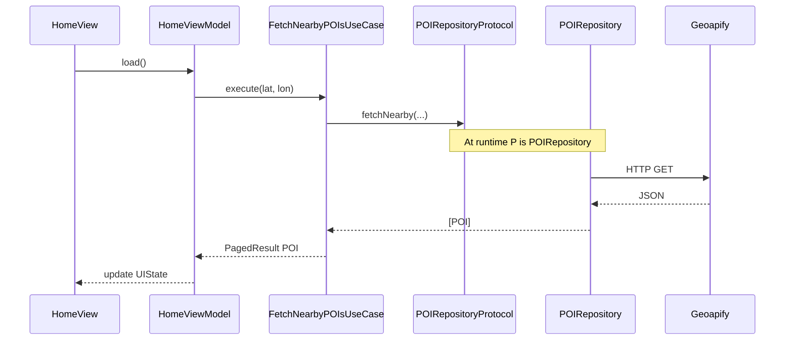
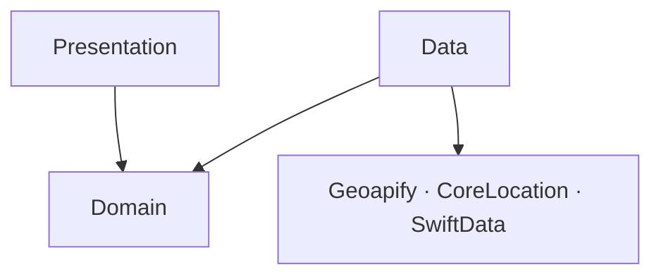

# Architecture Overview

*How I structured Discover: one study app, not a universal template.*

**Discover** is the SwiftUI example in Blueprint: iOS 17+, [Geoapify](https://www.geoapify.com/) for nearby places, details, and city geocoding.

Two tabs on a `TabView`:

- **Discover**: POI list near GPS location, pagination, name filter, **city search** (geocoding)
- **Favorites**: places saved on device with SwiftData

**Detail** is pushed from either tab: extended info, optional map, favorite toggle.

I organized the codebase around **[Clean Architecture](https://blog.cleancoder.com/uncle-bob/2012/08/13/the-clean-architecture.html)** (Robert C. Martin): entities and rules at the center, UI and infrastructure on the outside, dependencies pointing inward. I did not invent this; I used it because it gave me a clear place for each concern while learning.

## How it maps to folders

| Clean Architecture | Blueprint folder | Examples |
|---|---|---|
| Entities | `Domain/Entities/` | `POI`, `AppError`, `PagedResult` |
| Use Cases | `Domain/UseCases/` | `FetchNearbyPOIsUseCase`, `FavoritesUseCase` |
| Interface Adapters | `Presentation/`, `Data/` | ViewModels, Repositories, DTO mappers |
| Frameworks & Drivers | Geoapify, SwiftData, SwiftUI | Used inside Data and Presentation |

| Folder | Role |
|---|---|
| **Presentation** | Views, ViewModels, UIState |
| **Domain** | Entities, Use Cases, protocols |
| **Data** | Repository implementations, DTOs, cache, SwiftData |
| **DI / Navigation** | `DIContainer`, factories, `AppRoute` |

In this repo I kept Geoapify DTOs and SwiftData out of Presentation, and SwiftUI out of Domain. That boundary helped me more than it hurt on a three-screen app.

## Call chain (who calls whom)



| Step | Type | What it knows |
|---|---|---|
| View | `HomeView` | SwiftUI, `HomeViewModel` |
| ViewModel | `HomeViewModel` | UseCase protocols, `RouterProtocol` |
| Use Case | `FetchNearbyPOIsUseCase` | `POIRepositoryProtocol` (not Geoapify) |
| Protocol | `POIRepositoryProtocol` | Domain types only (`POI`) |
| Repository | `POIRepository` | HTTP, DTOs, cache, mappers |
| Entity | `POI` | Plain struct in Domain |

### What I did

ViewModels call UseCases. UseCases call repository protocols. The concrete `POIRepository` class is wired in DI.

### Why (then)

I wanted each layer to know as little as possible about the one below. Tests could mock `POIRepositoryProtocol` without faking HTTP. When Geoapify JSON changed, I hoped to touch Data only.

### What I'd reconsider

For a single-screen prototype I might let the ViewModel call the Repository directly and skip UseCases until a second screen needed the same rule. The extra hop is a trade-off, not a requirement of Clean Architecture.

## DTO → Entity

Geoapify JSON does not match `POI` field names:

```json
{ "properties": { "name": "Museum", "place_id": "abc" }, "geometry": { "coordinates": [-46.6, -23.5] } }
```

Inside `POIRepository`:

1. `NetworkClient` returns `Data`
2. `JSONDecoder` → `GeoapifyFeatureDTO` (Data layer, mirrors JSON)
3. `GeoapifyMapper.map(dto:)` → Domain `POI`
4. UseCase and ViewModel never import the DTO

Same idea for SwiftData: `FavoritePOI` (`@Model`) lives in Data; `FavoritesRepository` maps to Domain `POI`.

## Dependency rule

Dependencies point inward:



## Folder layout

```
blueprint/
├── Presentation/Views/     Screens + ViewModels
├── Domain/                 Entities + UseCases + protocols
├── Data/                   Repositories, DTOs, cache, SwiftData
├── DI/                     DIContainer, bundles, factories
└── Navigation/             AppRoute, AppRouter

Packages/
├── DesignSystem/           Shared UI tokens
└── Networking/             NetworkClient protocol
```

## Typical request (Home)

1. `HomeView` → `HomeViewModel.load()`
2. ViewModel → `FetchNearbyPOIsUseCase.execute(...)`
3. UseCase → `POIRepositoryProtocol.fetchNearby(...)`
4. `POIRepository` hits cache or Geoapify, decodes, maps to `[POI]`
5. UseCase wraps `PagedResult`, returns to ViewModel
6. ViewModel sets `HomeUIState.success`

## Could I have skipped Clean Architecture?

Yes. Discover could be three Views with `@State` and API calls in extensions. I chose layers because I was studying where logic, UI, and I/O live in a codebase I'd actually navigate for months. A smaller app might not need this split; a larger one might need more (feature modules, etc.).

## Where to read next

| Topic | Page |
|---|---|
| MVVM on each screen | [MVVM](/architecture/mvvm/) |
| Entities & UseCases | [Domain](/architecture/domain/) |
| Repositories vs Services | [Repositories & Services](/architecture/repositories-and-services/) |
| HTTP & DTOs | [Networking](/architecture/networking/) |
| Favorites on disk | [SwiftData](/architecture/swiftdata/) |
| DIContainer & factories | [Dependency Injection](/architecture/dependency-injection/) |
| AppRoute & stacks | [Navigation](/architecture/navigation/) |
| Swift Packages | [Modularization](/architecture/modularization/) |
| Boot to first POI on screen | [App Flow](/architecture/app-flow/) |
