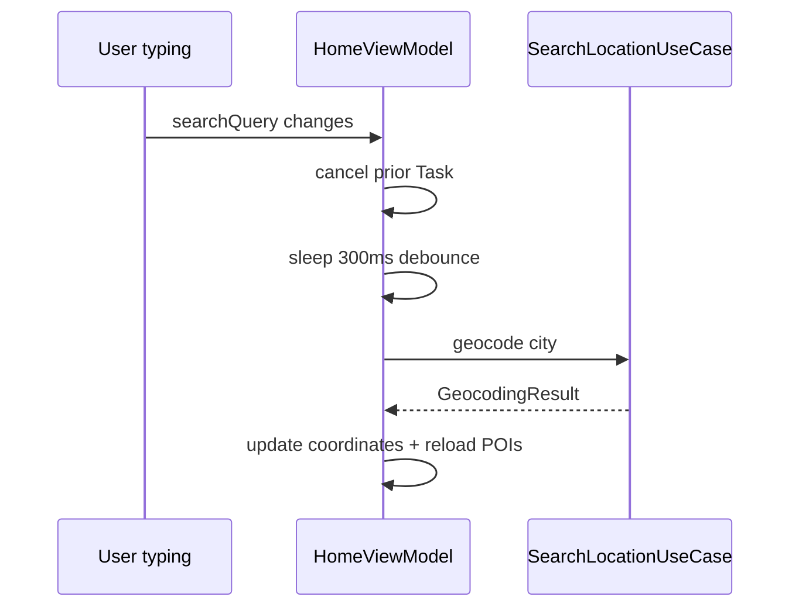

# Performance

## The problem

Unbounded API calls, undebounced search, and reload-on-navigation waste battery and feel sluggish.

## Why pragmatic performance

Blueprint avoids micro-optimizations. Focus: reduce unnecessary network calls, keep main thread responsive, log meaningfully.

## Key strategies

| Strategy | Implementation |
|---|---|
| Cache | `POICacheService`, 5 min TTL, file-backed |
| Pagination | Offset-based, 20 items per page |
| Debounce | `Task.sleep` + cancel, 300ms search, 400ms geocoding |
| Idle guard | `guard case .idle` prevents reload on navigation back |
| Logging | OSLog with subsystem/category |

Pagination loads 20 items per page. `loadMore()` appends when the user reaches the list footer.

## Trade-offs

- **5 min TTL:** balances freshness vs API quota (3,000/day free tier)
- **@MainActor cache:** simpler than actor with project's default isolation; revisit if I/O grows heavy

## Related code

- `blueprint/Data/Cache/POICacheService.swift`
- `blueprint/Presentation/Views/Home/HomeViewModel.swift`
- `blueprint/Core/Logging/AppLogger.swift`

## Further reading

- [Caching](/architecture/caching/)
- [Logging](/concepts/logging/)
- [Feature Flags](/architecture/feature-flags/)
