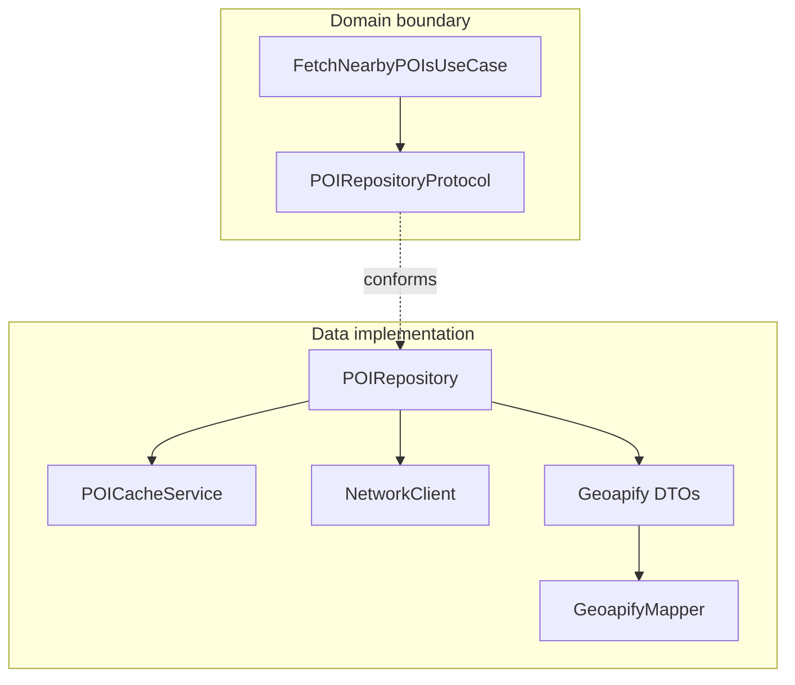

# Why Repository?

Repositories are the **Data layer gate**. UseCases ask for POIs, place details, geocoding results, or favorites. They never construct URLs, decode JSON, or touch `ModelContext`.

## What problem does this solve?

When ViewModels or UseCases call `URLSession` or SwiftData directly:

- Geoapify field names leak upward
- Tests need network or disk
- Swapping API or persistence requires editing Presentation

## Why this solution?

One protocol per data concern. Implementations live in `blueprint/Data/Repositories/` and `blueprint/Data/Persistence/`.

| Protocol | Implementation | Backing |
|---|---|---|
| `POIRepositoryProtocol` | `POIRepository` | Geoapify Places + `POICacheService` |
| `PlaceDetailsRepositoryProtocol` | `PlaceDetailsRepository` | Geoapify Place Details |
| `GeocodingRepositoryProtocol` | `GeocodingRepository` | Geoapify Geocoding |
| `FavoritesRepositoryProtocol` | `FavoritesRepository` | SwiftData |

UseCases depend on protocols defined next to repositories or use cases. Presentation never imports repository concrete types.

## Alternatives

| Approach | Verdict |
|---|---|
| URLSession inside ViewModel | Rejected: untestable |
| Codable on Domain `POI` | Rejected: API shapes pollute Domain |
| Single god repository | Rejected: mixed concerns |
| **Protocol per source** | Chosen |

## Trade-offs

- **Pro:** Mock repositories in tests (`MockPOIRepository`, `MockGeocodingRepository`)
- **Pro:** Cache policy stays inside `POIRepository`, invisible to UseCases
- **Con:** DTOs + mappers + protocol + class per endpoint group
- **Con:** More files than a prototype

## How Blueprint implements it

**Allowed call chain**

```
View → ViewModel → UseCase → Repository → (NetworkClient | Cache | SwiftData)
```

**Example: nearby POIs**

1. `HomeViewModel` calls `FetchNearbyPOIsUseCase.execute`
2. UseCase calls `POIRepositoryProtocol.fetchNearby`
3. `POIRepository` checks cache on `offset == 0`, else calls `NetworkClient`
4. DTO decodes, `GeoapifyMapper` produces `[POI]`



## Related code

- `blueprint/Data/Repositories/POIRepository.swift`
- `blueprint/Data/Repositories/POIRepositoryProtocol.swift`
- `blueprint/Data/Repositories/PlaceDetailsRepository.swift`
- `blueprint/Data/Repositories/GeocodingRepository.swift`
- `blueprint/Data/Persistence/FavoritesRepository.swift`
- `blueprint/Domain/UseCases/FetchNearbyPOIsUseCase.swift`
- `blueprintTests/Mocks/MockPOIRepository.swift`

## Further reading

- [Networking](/architecture/networking/)
- [Caching](/architecture/caching/)
- [SwiftData](/architecture/swiftdata/)
- [ADR 0005: SwiftData Domain Separation](/decisions/0005-swiftdata-domain-separation/)
