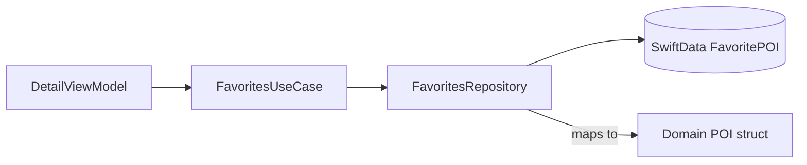

# Why SwiftData?

Discover persists **favorite POIs** on device. SwiftData is Apple's persistence framework for SwiftUI-era apps. Blueprint uses it **only in the Data layer**.

## What problem does this solve?

Favorites must survive app restarts. Storing `[POI]` in UserDefaults does not scale for queries, deduplication, or future migrations.

Putting `@Model` on Domain `POI` would force Domain to import SwiftData and accept framework-generated class semantics.

## Why this solution?

Separate persistence model + repository mapping:

| Layer | Type |
|---|---|
| Domain | `POI` struct (`Hashable`, `Sendable`, `Codable`) |
| Data | `FavoritePOI` `@Model` class |
| Boundary | `FavoritesRepository` maps both ways |

`FavoritesUseCase` exposes toggle/query to ViewModels. `DetailViewModel` never sees `ModelContext`.

## Alternatives

| Approach | Verdict |
|---|---|
| `@Model` on Domain `POI` | Rejected: violates clean architecture |
| UserDefaults array of IDs | Rejected: no rich queries |
| Core Data | Valid; SwiftData chosen for iOS 17+ teaching value |
| **FavoritePOI + Repository** | Chosen |

## Trade-offs

- **Pro:** Domain entity stays a plain struct
- **Pro:** SwiftData schema isolated to `FavoritePOI`
- **Pro:** Repository protocol mockable (future tests)
- **Con:** Duplicate fields between `POI` and `FavoritePOI`
- **Con:** `FavoritesRepository` is `@MainActor` (main-thread context)

## How Blueprint implements it

**Schema**

`PersistenceDependencies` creates `ModelContainer(for: FavoritePOI.self)` once. Failure calls `fatalError` (schema conflict or storage unavailable).

**Repository API**

- `isFavorite(id:)`
- `add(_ poi:)` / `remove(id:)`
- `fetchAll()` → `[POI]`

**UseCase**

`FavoritesUseCase` forwards to `FavoritesRepositoryProtocol`. `DetailViewModel.toggleFavorite()` catches errors and surfaces `favoriteError` string.

## Related code

- `blueprint/Data/Persistence/FavoritePOI.swift`
- `blueprint/Data/Persistence/FavoritesRepository.swift`
- `blueprint/Data/Persistence/FavoritesRepositoryProtocol.swift`
- `blueprint/Domain/UseCases/FavoritesUseCase.swift`
- `blueprint/DI/Core/PersistenceDependencies.swift`
- `blueprint/Presentation/Views/Detail/DetailViewModel.swift`

## Further reading

- [ADR 0005: SwiftData Domain Separation](/decisions/0005-swiftdata-domain-separation/)
- [Repository Pattern](/architecture/repository/)
- [MVVM](/architecture/mvvm/)
