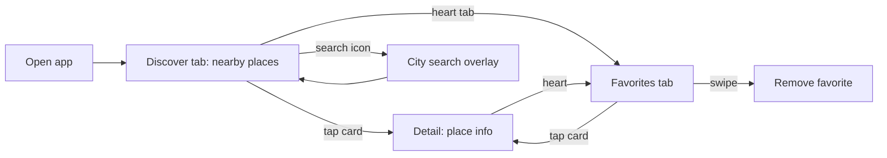

# About Discover

Before diving into Clean Architecture, MVVM, or repositories, it helps to know **what the app actually does** and **why the code talks about POIs all the time**.

## Blueprint vs Discover

| Name | What it is |
|---|---|
| **Blueprint** | The GitHub repository and study project. Architecture, docs, and ADRs live here. |
| **Discover** | The runnable iOS app inside Blueprint. This is what you build and run in the simulator. |

Blueprint is the textbook. Discover is the example exercise.

## What is a POI?

**POI** stands for **Point of Interest**: any real-world place worth showing on a map or in a list.

Examples in Discover:

- Restaurants and cafés
- Museums and tourist attractions
- Parks and public spaces
- Hotels

In code, a POI is a `struct` with a name, coordinates, categories, and optional address details. The type lives in `blueprint/Domain/Entities/POI.swift`.

You will see `POI` in type names (`POIRepository`, `POICardView`, `FetchNearbyPOIsUseCase`) because the whole app revolves around listing and exploring places.

## What Discover does (user perspective)

1. **Open the app** on Home
2. **See places near you** (uses GPS, or a default city if permission is denied)
3. **Search for another city** if you want POIs somewhere else
4. **Tap a place** to open Detail with more info
5. **Favorite a place** to save it on the device (SwiftData)
6. **Open the Favorites tab** to see saved places, remove them, or open Detail again
7. **See a map preview** on Detail when the `mapView` feature flag is on

Discover is intentionally small. Two tabs (Discover and Favorites), Detail, and a city search overlay. That keeps the architecture docs readable without product complexity getting in the way.

## Screens

| Screen | File | Purpose |
|---|---|---|
| **Discover (Home)** | `HomeView` | Scrollable list of nearby POIs, search, pagination, skeleton loading |
| **Favorites** | `FavoritesView` | Saved POIs from SwiftData, swipe to remove, tap to open Detail |
| **Detail** | `DetailView` | Name, category, address, hours, phone, website, optional map, favorite button |
| **City search** | `LocationSearchView` | Type a city name, pick a result, reload POIs for that area |

## Where the data comes from

Discover does not ship a local database of every restaurant in the world. It calls **[Geoapify](https://www.geoapify.com/)**, a geolocation API:

| API | Used for |
|---|---|
| Places | Nearby POI list on Home |
| Place Details | Extra fields on Detail (phone, website, hours) |
| Geocoding | Turn "São Paulo" into coordinates for search |

Results are cached on disk for five minutes so going back to Home does not always hit the network.

See [API Key Setup](/guides/api-key-setup/) to configure your key.

## Domain vocabulary (quick glossary)

Terms you will see in architecture articles and Swift files:

| Term | Plain meaning |
|---|---|
| **POI** | A place: name + location + category (the main entity) |
| **PlaceDetails** | Extra info fetched on Detail (may overlap with POI fields) |
| **PlaceCategory** | Type of place: tourism, catering, accommodation, etc. |
| **Geocoding** | Converting a city name into latitude/longitude |
| **PagedResult** | A page of POIs plus metadata for "load more" pagination |
| **Favorite** | A POI the user saved locally with SwiftData |
| **Repository** | Code that talks to Geoapify or SwiftData on behalf of UseCases |
| **UseCase** | One app operation: "fetch nearby POIs", "toggle favorite", etc. |

## Feature flags in the product

Some UI is gated behind flags (see [Feature Flags](/architecture/feature-flags/)):

| Flag | Effect |
|---|---|
| `.favorites` | Favorites tab, heart button on Detail |
| `.mapView` | Map section on Detail |
| `.categoryFilter` | Not wired yet (reserved for Home filters) |

## Why this domain?

Native Birds (the reference project) used bird sightings. Blueprint uses **places** because:

- Everyone understands restaurants and museums without domain expertise
- Geoapify has a generous free tier for learning projects
- Location, search, cache, detail fetch, and persistence map cleanly to common iOS patterns

The product is a vehicle for architecture. You are not expected to ship Discover to the App Store.

## Next steps

- [Getting Started](/guides/getting-started/): clone, API key, first run
- [Architecture Overview](/architecture/overview/): layers, data flow, and how POIs move through the stack
