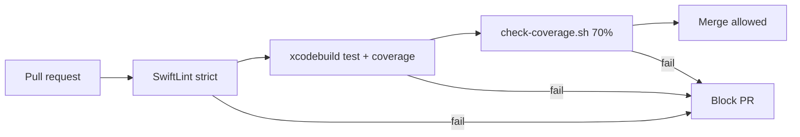

# CI/CD

## Pipeline

Every pull request to `main` runs on `macos-15`:

1. **SwiftLint** (`swiftlint lint --strict`)
2. **Checkout**
3. **Select Xcode 16.3**
4. **Create `Config.xcconfig`** from `GEOAPIFY_API_KEY` secret
5. **`xcodebuild test`** with `-enableCodeCoverage YES`
6. **Coverage gate:** `./scripts/check-coverage.sh build/coverage.xcresult 70`

PRs fail if tests fail or if the **`blueprint` app target** line coverage drops below **70%**.



## Signing

CI uses `CODE_SIGNING_ALLOWED=NO`, simulator builds only, no provisioning profiles required.

## Coverage script

Local usage:

```bash
xcodebuild test \
  -project blueprint.xcodeproj \
  -scheme blueprint \
  -destination 'platform=iOS Simulator,name=iPhone 16,OS=latest' \
  -enableCodeCoverage YES \
  -resultBundlePath /tmp/blueprint-coverage.xcresult \
  CODE_SIGNING_ALLOWED=NO

./scripts/check-coverage.sh /tmp/blueprint-coverage.xcresult 70
```

## SwiftLint

Run locally before pushing:

```bash
swiftlint lint --strict
```

## Website CI

Documentation has a separate workflow (`.github/workflows/website.yml`):

- Builds Saga site on macOS
- Deploys static output to Vercel

## Related

- [Running Tests](/guides/running-tests/)
- [Contributing](/guides/contributing/)
- [Documentation Site](/guides/documentation-site/)
- [API Key Setup](/guides/api-key-setup/)
