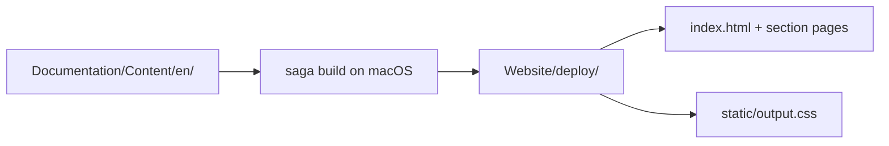

# Build & Preview

Saga runs on **macOS** (Swift executable). Output is plain static files in `Website/deploy/`: HTML, CSS, and copied assets. Any static file host can serve that folder.

## Local preview

```bash
brew install loopwerk/tap/saga
./scripts/saga dev --port 3000
```

Open [http://localhost:3000](http://localhost:3000). Saga watches `Documentation/` and `Website/Sources/` and rebuilds on change.

Use the repo-root wrapper:

```bash
./scripts/saga dev --port 3000
```

Running `saga` from the repository root without the script fails because `Package.swift` lives in `Website/`.

## Production build

```bash
./scripts/saga build
```

Output: `Website/deploy/`

Open `Website/deploy/index.html` in a browser or serve the folder with any static server to sanity-check before pushing.

## What the build produces



Each Markdown file becomes an HTML page. Section folders get an `index.html` listing. Tailwind CSS is compiled and copied to `deploy/static/`.

## CI

Pull requests and pushes to `main` run `.github/workflows/website.yml`:

1. Restore `Website/.build` cache (Swift compile + Saga read cache)
2. `swift build -c release` and run the `Website` executable (no Homebrew `saga` in CI)
3. Verify `Website/deploy/index.html` exists
4. Upload `deploy/` as a CI artifact (retained 7 days)

The workflow caches `Website/.build` and the SwiftPM download cache between runs. Only changes to `Package.swift` or `Package.resolved` invalidate the compile cache; Markdown edits reuse the compiled pipeline and rebuild pages only.

On `main`, a follow-up job also publishes the built site when `VERCEL_TOKEN`, `VERCEL_ORG_ID`, and `VERCEL_PROJECT_ID` are set in GitHub secrets.

**404 on Vercel?** The `deploy/` folder is gitignored. Vercel Git integration alone cannot build Saga (macOS only). In **Settings → Build and Deployment → Ignored Build Step**, choose **Don't build anything**, then deploy via GitHub Actions or `./scripts/saga build && cd Website/deploy && vercel deploy --prod`.

PRs **build only** (no publish) so doc changes are validated before merge.

## URL shape

`Website/vercel.json` documents the expected URL style for the generated site:

```json
{
  "cleanUrls": true,
  "trailingSlash": true
}
```

Example: `guides/getting-started.md` → `/guides/getting-started/`

## Troubleshooting

| Symptom | Fix |
|---|---|
| `saga: command not found` | `brew install loopwerk/tap/saga` |
| Build fails from repo root | `./scripts/saga build` |
| Sidebar missing new page | Add entry to `SiteCatalog.swift` |
| Mermaid shows as code | Rebuild; see [Mermaid](/website/mermaid/) |
| Tailwind classes missing | Edit `Theme.swift` or `input.css`, rebuild |

## Related

- [Site Overview](/website/overview/)
- [Saga Pipeline](/website/pipeline/)
- [ADR 0007: Saga for Documentation Site](/decisions/0007-saga-documentation-site/)
