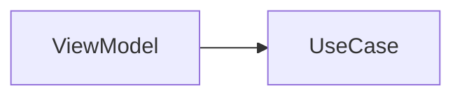

# Implementation

This page goes deeper into **how** the site is rendered. For tool introductions and local commands, start at [Site Overview](/website/overview/).

## Templates (Swim)

HTML is built with [Swim](https://github.com/loopwerk/SagaSwimRenderer) in `templates.swift`. There are no hand-written `.html` files in the repo.

Every page shares **`docsShell`**: top bar, sidebar (from `SiteCatalog`), main content, footer ("Built in Swift with Saga").

```swift
func docsShell(
  title pageTitle: String,
  activeSection: DocSection? = nil,
  activeSlug: String? = nil,
  isOverview: Bool = false,
  @NodeBuilder content: () -> Node
) -> Node
```

Per-section renderers:

| Renderer | Used for |
|---|---|
| `renderHome` | Root `index.md` |
| `renderArchitecture` | Each architecture article |
| `renderWebsite` | Each website meta-doc |

Shared building blocks:

| Component | Role |
|---|---|
| `docHeader` | Eyebrow, title, summary |
| `proseBody` | Markdown HTML + Moon + Mermaid prep |
| `footerNav` | Previous / Next within a section |
| `sectionIndexTiles` | Card grid on section index pages |

## Markdown → HTML pipeline

Inside `proseBody`:

```swift
func proseBody(_ html: String) -> Node {
  let highlighted = Moon.shared.highlightCodeBlocks(in: html)
  let prepared = MermaidProcessor.prepareBlocks(in: highlighted)
  return Node.raw(prepared)
}
```

1. **Parsley** (Saga reader) converts Markdown to HTML at read time
2. **Moon** adds syntax highlighting to fenced code blocks
3. **MermaidProcessor** rewrites ` ```mermaid ` blocks into `<div class="mermaid">`
4. **`Node.raw`** injects HTML without double-escaping (required for Mermaid init scripts in the layout)

## Tailwind CSS

[SwiftTailwind](https://github.com/loopwerk/SwiftTailwind) runs in the `beforeRead` hook when Swift templates or CSS change:

```swift
try await tailwind.run(
  input: "../Documentation/Content/en/static/input.css",
  output: "../Documentation/Content/en/static/output.css",
  options: .minify
)
```

`input.css` (Tailwind v4):

```css
@import "tailwindcss";
@plugin "@tailwindcss/typography";

@source "../../../../Website/Sources/Website/**/*.swift";
@source "../**/*.md";
```

- `@source ...swift`: scan `Theme.swift` and templates for class names
- `@source ...md`: scan Markdown for arbitrary classes (rare)

`Theme.swift` centralizes strings like `Theme.prose`, `Theme.sidebarLinkActive`. Templates stay readable; Tailwind still purges unused classes.

The layout links the hashed stylesheet:

```swift
link(href: Saga.hashed("/static/output.css"), rel: "stylesheet")
```

`Saga.hashed` changes the URL when CSS content changes (cache busting on Vercel).

After HTML generation, `afterWrite` copies `output.css` into `deploy/static/output.css`.

`.ignoreChanges("output.css")` prevents infinite rebuild loops in dev.

## Mermaid diagrams

Architecture articles use fenced blocks:

````markdown

````

By default Parsley + Moon leave that as a highlighted `<pre><code>`. Browsers do not render it as a diagram.

`MermaidProcessor.swift` finds those blocks at build time and replaces them with:

```html
<div class="mermaid">flowchart LR ...</div>
```

`docsShell` loads Mermaid 11 from a CDN and initializes with `Node.raw` (normal string escaping breaks the init script).

Custom rules in `input.css` style `.prose .mermaid` for borders and responsive SVG width.

## Sidebar catalog

Saga generates pages from **folders**. The sidebar also needs **`SiteCatalog.swift`**: an explicit list of `SiteEntry` rows (section, slug, title, order).

If you add `architecture/new-topic.md` but skip the catalog, the page builds and has a URL, but the sidebar will not link to it.

## Related code

- `Website/Sources/Website/templates.swift`
- `Website/Sources/Website/Theme.swift`
- `Website/Sources/Website/MermaidProcessor.swift`
- `Website/Sources/Website/SiteCatalog.swift`
- `Website/Sources/Website/main.swift`

## Next

[Build & Preview](/website/deploy/)
