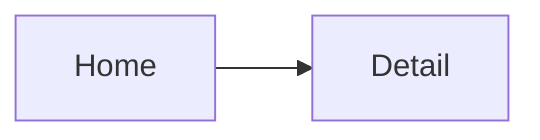
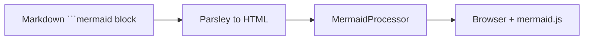

# Mermaid Diagrams

Architecture articles use Mermaid for flowcharts and sequence diagrams. Markdown authors write fenced blocks; the site renders interactive SVG at read time.

## Authoring

In any `.md` file:

````markdown

````

Parsley + Moon turn this into a highlighted `<pre><code class="language-mermaid">` block.

## The problem we hit

By default that stays a code block in the browser. Mermaid.js expects `<div class="mermaid">` with raw diagram source.

We also hit a **script escaping bug**: injecting Mermaid init through Swim's normal string escaping produced `&apos;` in JavaScript and broke rendering.

## MermaidProcessor

`Website/Sources/Website/MermaidProcessor.swift` runs at build time inside `proseBody`:

1. Regex-match `<pre><code class="language-mermaid">...</code></pre>`
2. Decode HTML entities and strip inner tags
3. Replace with a styled wrapper:

```html
<div class="mermaid mermaid-wide">
  flowchart LR ...
</div>
```

## Client init

At the bottom of `docsShell`, templates inject:

```swift
script(src: "https://cdn.jsdelivr.net/npm/mermaid@11/dist/mermaid.min.js") {}
script { Node.raw(#"mermaid.initialize({ ... });"#) }
```

`Node.raw` is critical: the init script must not be HTML-escaped.

Config highlights:

- `theme: "neutral"` for light/dark compatibility
- `flowchart.useMaxWidth: true` so diagrams use horizontal space (fixes tall/narrow layout)

## CSS support

`input.css` styles `.prose .mermaid` with borders, padding, and `svg { width: 100% }` so diagrams scale on mobile.

## Pipeline



## When not to use Mermaid

Skip diagrams for topics that do not benefit from visualization (short config notes, single-step instructions). Prefer prose or tables.

## Related code

- `Website/Sources/Website/MermaidProcessor.swift`
- `Website/Sources/Website/templates.swift` (`proseBody`, `mermaidScripts`)
- `Documentation/Content/en/static/input.css`

## Next

[Build & Preview](/website/deploy/): local dev, production build, and CI.
