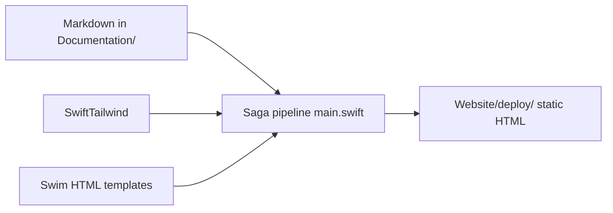

# Documentation Site Overview

Blueprint ships two deliverables in one repository:

| Piece | Location | Role |
|---|---|---|
| **Content** | `Documentation/Content/en/` | Markdown articles (source of truth) |
| **Generator** | `Website/` | Swift executable that builds static HTML |

The iOS app and the docs site share the same philosophy: explicit layers, no magic frameworks, teach by example.

## Stack



| Tool | Purpose |
|---|---|
| [Saga](https://getsaga.dev/) | Static site generator (Swift) |
| [Parsley](https://github.com/loopwerk/SagaParsleyMarkdownReader) | Markdown to HTML |
| [Swim](https://github.com/loopwerk/SagaSwimRenderer) | Type-safe HTML templates |
| [Moon](https://github.com/loopwerk/Moon) | Syntax highlighting for code blocks |
| [SwiftTailwind](https://github.com/loopwerk/SwiftTailwind) | Compile Tailwind CSS during build |

## Repository layout

```
Documentation/
└── Content/en/
    ├── index.md           Home / Overview
    ├── guides/
    ├── architecture/
    ├── concepts/
    ├── decisions/         ADRs
    ├── website/           This section (meta-docs about the site)
    └── static/
        ├── input.css      Tailwind entry
        └── output.css     Generated (gitignored from deploy copy)

Website/
├── Package.swift
├── Sources/Website/
│   ├── main.swift         Saga pipeline registration
│   ├── templates.swift    Page shells and renderers
│   ├── Theme.swift        Tailwind class tokens
│   ├── SiteCatalog.swift Sidebar navigation catalog
│   └── MermaidProcessor.swift
├── deploy/                Build output (gitignored)
└── vercel.json            Hosting config
```

## Local preview

```bash
brew install loopwerk/tap/saga
./scripts/saga dev --port 3000
```

Open [http://localhost:3000](http://localhost:3000).

## Build

```bash
./scripts/saga build
```

Output lands in `Website/deploy/`.

## How sections map to URLs

| Folder | URL | Sidebar label |
|---|---|---|
| `guides/` | `/guides/` | Guides |
| `architecture/` | `/architecture/` | Architecture |
| `concepts/` | `/concepts/` | Concepts |
| `decisions/` | `/decisions/` | ADRs |
| `website/` | `/website/` | Website |

Each folder gets an `index.html` list page plus one HTML file per Markdown article.

## Read next

1. [What is Saga?](/website/saga/)
2. [Saga Pipeline](/website/pipeline/)
3. [Build & Preview](/website/deploy/)
