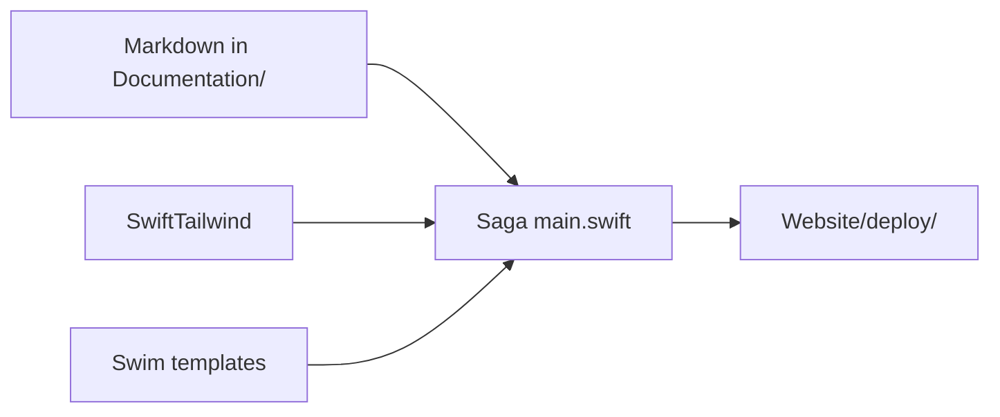

# Site Overview

Documentation site for Blueprint, built with **[Saga](https://getsaga.dev/)**, a Swift static site generator.

Markdown lives in `Documentation/Content/en/`. A Swift executable in `Website/` renders HTML with **Swim** templates, compiles **Tailwind CSS** during the build through **SwiftTailwind**, highlights code with **Moon**, and deploys static files to **Vercel** via GitHub Actions.

No Node.js app. No runtime server. Build on macOS, ship HTML.

## Technologies

If you only know the iOS app, this stack is new. Short intro to each piece:

| Tool | What it is | Role in Blueprint |
|---|---|---|
| **[Saga](https://getsaga.dev/)** | Static site generator written in Swift | Reads Markdown folders, runs hooks, writes `Website/deploy/` |
| **[Parsley](https://github.com/loopwerk/SagaParsleyMarkdownReader)** | Saga Markdown reader plugin | Turns `.md` frontmatter + body into HTML |
| **[Swim](https://github.com/loopwerk/SagaSwimRenderer)** | Type-safe HTML in Swift | `templates.swift` builds page shells (sidebar, footer, layout) |
| **[Moon](https://github.com/loopwerk/Moon)** | Syntax highlighter | Colors fenced code blocks in articles |
| **[SwiftTailwind](https://github.com/loopwerk/SwiftTailwind)** | Tailwind CLI wrapper for Swift | Compiles CSS at build time (no npm) |
| **Mermaid** (CDN) | Diagram renderer | Architecture pages use ` ```mermaid ` blocks |

Saga is **not** Markdown-only. You can generate pages from Swift with no content file. Blueprint uses Markdown because architecture notes fit that format. For a polished personal site with the same stack, see [rychillie.pages.dev](https://rychillie.pages.dev) ([source](https://github.com/Rychillie/Rychillie.net)).



## Requirements

- Swift 6.0+
- macOS 14+ (Saga build runs on Mac; CI uses `macos-latest`)
- [Saga CLI](https://getsaga.dev/docs/installation/) for local dev

Install Saga with Homebrew:

```bash
brew install loopwerk/tap/saga
```

CI does **not** use Homebrew. It runs `swift build` and the compiled `Website` binary instead.

## Development

From the repo root:

```bash
./scripts/saga dev --port 3000
```

Open [http://localhost:3000](http://localhost:3000). Saga watches `Documentation/` and `Website/Sources/` and rebuilds on change.

The wrapper script `cd`s into `Website/` before calling Saga. Running `saga` from the repo root without the script fails because `Package.swift` lives inside `Website/`.

## Build

```bash
./scripts/saga build
```

Saga reads from `Documentation/Content/en/` and writes to `Website/deploy/`.

| Path | Committed? |
|---|---|
| `Documentation/Content/en/**/*.md` | Yes (source of truth) |
| `Documentation/Content/en/static/input.css` | Yes (Tailwind entry) |
| `Documentation/Content/en/static/output.css` | Generated locally; copied to deploy |
| `Website/deploy/` | **No** (gitignored) |

Do not commit `Website/deploy/`. Production HTML comes from CI, not from git.

## Styling

Tailwind CSS is compiled during the Saga build through SwiftTailwind.

| File | Role |
|---|---|
| `Documentation/Content/en/static/input.css` | Tailwind v4 entry (`@import "tailwindcss"`, typography plugin) |
| `Documentation/Content/en/static/output.css` | Generated minified CSS |
| `Website/Sources/Website/Theme.swift` | Tailwind utility strings used by templates |
| `templates.swift` | Links CSS with `Saga.hashed("/static/output.css")` for cache busting |

When changing visuals, edit `Theme.swift` or `input.css`. Do not hand-edit `output.css`.

Details: [Implementation](/website/implementation/).

## Content

English content only today (`Documentation/Content/en/`). Portuguese placeholder: `Documentation/Content/pt-BR/`.

| Folder | URL | Purpose |
|---|---|---|
| `index.md` | `/` | Home, setup, roadmap |
| `architecture/` | `/architecture/` | iOS architecture notes |
| `website/` | `/website/` | This section (meta-docs) |

Article frontmatter:

```yaml
---
title: MVVM
summary: Optional short line for index tiles and page lead.
order: 1
---
```

`order` sorts list pages and sidebar entries. `SiteCatalog.swift` must list every page you want in the sidebar.

## Site generation

The Saga pipeline lives in `Website/Sources/Website/main.swift`:

1. **`beforeRead`**: compile Tailwind when Swift sources or CSS change
2. **Read**: Parsley parses Markdown per registered folder
3. **Write**: Swim renderers emit HTML to `deploy/`
4. **`afterWrite`**: copy `output.css` to `deploy/static/`, write `vercel.json`

Registrations today:

| Folder | Output |
|---|---|
| `architecture/` | `/architecture/*` + index |
| `website/` | `/website/*` + index |
| root `index.md` | `/` (home) |

Templates use Moon for code blocks and `MermaidProcessor` for diagrams. See [Implementation](/website/implementation/).

## Project layout

```
Website/
├── Package.swift              Saga, Swim, Moon, SwiftTailwind deps
├── Sources/Website/
│   ├── main.swift             Pipeline, hooks, folder registration
│   ├── templates.swift        docsShell, section renderers
│   ├── Theme.swift            Tailwind class constants
│   ├── SiteCatalog.swift      Sidebar navigation catalog
│   └── MermaidProcessor.swift Diagram post-processing
├── deploy/                    Generated output (gitignored)
└── vercel.json                Hosting config reference

Documentation/Content/en/
├── index.md
├── architecture/
├── website/
└── static/                    input.css, output.css (generated)

scripts/saga                     Repo-root wrapper for saga dev/build
.github/workflows/website.yml  macOS build + Vercel deploy
```

## CI and deployment

Pull request and push CI runs from `.github/workflows/website.yml` when `Website/`, `Documentation/`, or the workflow file change.

The workflow:

1. Runs on `macos-latest`
2. Restores SwiftPM / `.build` cache
3. Runs `swift build` + the `Website` executable (no Homebrew Saga)
4. Verifies `Website/deploy/index.html`
5. Uploads artifact

On push to `main`, a second job deploys `Website/deploy/` to Vercel with `vercel deploy --prod`.

Vercel Git integration is disabled for builds (**Ignored Build Step → Don't build anything**). Only GitHub Actions publishes production.

Full deploy notes: [Build & Preview](/website/deploy/).

## Read next

- [Implementation](/website/implementation/): templates, Tailwind, Mermaid in depth
- [Build & Preview](/website/deploy/): troubleshooting and Vercel setup
