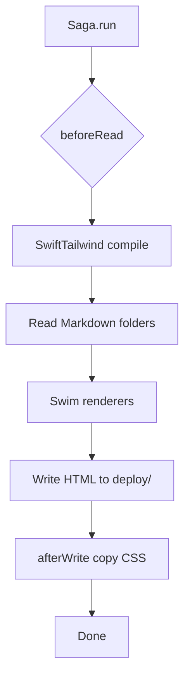

# Saga Pipeline

The entire site generator lives in `Website/Sources/Website/main.swift`. One executable, one pipeline.

## Entry point

```swift
try await Saga(input: "../Documentation/Content/en", output: "deploy")
```

Saga reads Markdown from `Documentation/Content/en/` relative to `Website/` and writes HTML to `Website/deploy/`.

## Metadata types

Two frontmatter schemas:

**Articles** (`DocMetadata`):

```swift
struct DocMetadata: Metadata {
  let summary: String?
  let order: Int?
}
```

**ADRs** (`ADRMetadata`):

```swift
struct ADRMetadata: Metadata {
  let summary: String?
  let status: String
  let date: String?
  let order: Int?
}
```

`order` controls sorting in list pages and sidebar (`SiteCatalog.swift` mirrors the same order for navigation).

## Folder registrations

Each content folder registers the same pattern:

```swift
.register(
  folder: "guides",
  metadata: DocMetadata.self,
  readers: [.parsleyMarkdownReader],
  sorting: { ($0.metadata.order ?? 0) < ($1.metadata.order ?? 0) },
  writers: [
    .itemWriter(swim(renderGuide)),
    .listWriter(swim(renderGuideIndex), output: "index.html"),
  ]
)
```

| Registration | Item renderer | List renderer |
|---|---|---|
| `guides/` | `renderGuide` | `renderGuideIndex` |
| `architecture/` | `renderArchitecture` | `renderArchitectureIndex` |
| `concepts/` | `renderConcept` | `renderConceptIndex` |
| `decisions/` | `renderADR` | `renderADRIndex` |
| `website/` | `renderWebsite` | `renderWebsiteIndex` |
| root `index.md` | `renderHome` | (none) |

`swim(...)` connects Swim templates to Saga writers. Each renderer returns an HTML `Node`.

## Tailwind hook (`beforeRead`)

Saga rebuilds CSS when content or Swift templates change:

```swift
.beforeRead { saga in
  if let path = saga.buildReason.changedFile(),
     path.extension != "css",
     !path.components.contains("Sources")
  {
    return  // skip Tailwind when only Markdown changed
  }
  try await tailwind.run(
    input: tailwindInput,
    output: tailwindOutput,
    options: .minify
  )
}
```

SwiftTailwind compiles `Documentation/Content/en/static/input.css` into `output.css`.

`.ignoreChanges("output.css")` prevents infinite rebuild loops.

## Asset copy (`afterWrite`)

After HTML generation, `output.css` is copied into `deploy/static/output.css` for production URLs.

## Pipeline diagram



## Adding a new section

1. Create `Documentation/Content/en/my-section/*.md` with frontmatter
2. Add `case mySection` to `DocSection` in `SiteCatalog.swift`
3. Register the folder in `main.swift`
4. Add `renderMySection` + `renderMySectionIndex` in `templates.swift`
5. Add entries to `siteCatalog` array

No change to Saga itself. The pipeline is data-driven from your registrations.

## Related code

- `Website/Sources/Website/main.swift`
- `Website/Package.swift` (Saga, Swim, Moon, SwiftTailwind dependencies)
- `scripts/saga` (repo-root wrapper)

## Next

[Content Model](/website/content-model/): frontmatter, folders, and `SiteCatalog`.
