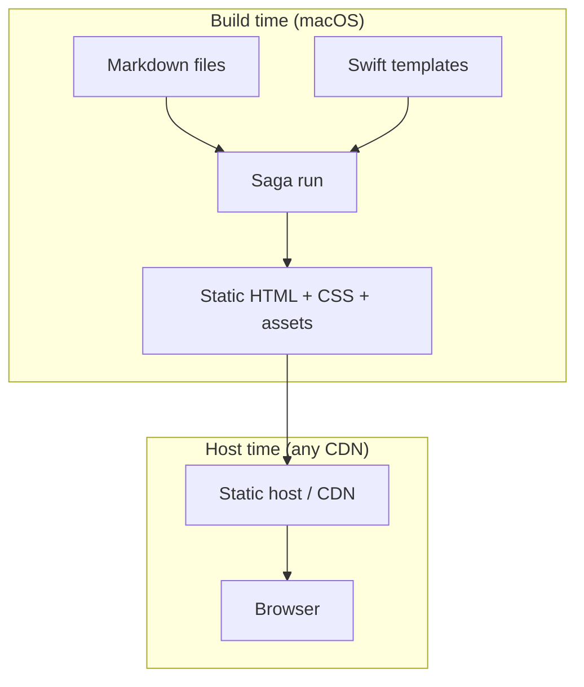

# What is Saga?

[Saga](https://getsaga.dev/) is a **static site generator written in Swift**. You point it at a folder of Markdown files, register how each folder should be read and rendered, and it emits plain HTML you can host anywhere.

Official docs: [getsaga.dev/docs](https://getsaga.dev/docs/)

## Why Saga for Blueprint?

| Reason | Detail |
|---|---|
| Same language | iOS app is Swift; docs tooling is Swift |
| Type-safe templates | HTML built with Swim, not string soup |
| Markdown stays in git | No CMS, no Notion export |
| Extensible pipeline | Hooks like `beforeRead`, `afterWrite`, custom processors |

Alternatives we rejected are recorded in [ADR 0007](/decisions/0007-saga-documentation-site/): GitHub-only rendering, Next.js, Astro.

## Core concepts (Saga vocabulary)

| Term | Meaning |
|---|---|
| **Input folder** | Where Markdown lives (`Documentation/Content/en/`) |
| **Output folder** | Where HTML is written (`Website/deploy/`) |
| **Registration** | Per-folder rules: metadata type, reader, writers |
| **Reader** | Turns a file into parsed content (we use Parsley for Markdown) |
| **Writer** | Turns parsed content into output files |
| **Item writer** | One HTML page per Markdown file |
| **List writer** | Index page for a folder (e.g. `/guides/index.html`) |
| **Metadata** | Frontmatter fields decoded into a Swift struct |

## Installation

```bash
brew install loopwerk/tap/saga
```

Saga wraps the Swift package in `Website/`. Blueprint also ships `./scripts/saga` so you can run commands from the repo root:

```bash
./scripts/saga dev --port 3000
./scripts/saga build
```

The script `cd`s into `Website/` before calling the Saga CLI. Running `saga` from the repo root without the script fails because `Package.swift` lives inside `Website/`.

## Saga vs "a website framework"

Saga is **not** a runtime server. It runs at build time, produces static files, and exits.

That matches documentation needs: content changes, rebuild, deploy.

## Minimal mental model



## Official resources

- [Saga documentation](https://getsaga.dev/docs/)
- [Installation](https://getsaga.dev/docs/installation/)
- [GitHub: loopwerk/Saga](https://github.com/loopwerk/Saga)
- [Swim renderer](https://github.com/loopwerk/SagaSwimRenderer)
- [Parsley Markdown reader](https://github.com/loopwerk/SagaParsleyMarkdownReader)

## Next

[Saga Pipeline](/website/pipeline/): how Blueprint wires registrations in `main.swift`.
