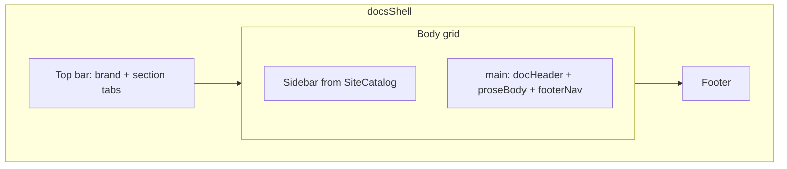

# Templates & Theme

HTML is built with [Swim](https://github.com/loopwerk/SagaSwimRenderer) inside `Website/Sources/Website/templates.swift`. No `.html` files hand-written in the repo.

## docsShell

Every page shares one layout function:

```swift
func docsShell(
  title pageTitle: String,
  activeSection: DocSection? = nil,
  activeSlug: String? = nil,
  isOverview: Bool = false,
  @NodeBuilder content: () -> Node
) -> Node
```

It renders:

| Region | Content |
|---|---|
| `<head>` | Title, meta, hashed CSS link |
| Top bar | Brand + section tabs + GitHub link |
| Sidebar | Overview link + per-section article list from `SiteCatalog` |
| `<main>` | Page body (passed in) |
| Footer | "Built with Saga" |

Active section and slug drive highlight states in the top nav and sidebar.

## Render functions

Each content type has two renderers:

| Function | When |
|---|---|
| `renderGuide` | Single guide article |
| `renderGuideIndex` | `/guides/` tile list |

Same pattern for `Architecture`, `Concept`, `ADR`, and `Website`.

Shared building blocks:

| Component | Role |
|---|---|
| `docHeader` | Eyebrow, title, summary, optional badges |
| `proseBody` | Markdown HTML + Moon highlighting + Mermaid prep |
| `footerNav` | Previous / Next links within the same section |
| `sectionIndexTiles` | Grid of cards on index pages |

## proseBody pipeline

```swift
func proseBody(_ html: String) -> Node {
  let highlighted = Moon.shared.highlightCodeBlocks(in: html)
  let prepared = MermaidProcessor.prepareBlocks(in: highlighted)
  return Node.raw(prepared)
}
```

1. Parsley converts Markdown to HTML
2. Moon adds syntax highlighting to fenced code blocks
3. `MermaidProcessor` rewrites ` ```mermaid ` blocks into `<div class="mermaid">`
4. `Node.raw` injects the final HTML without double-escaping (important for Mermaid init scripts)

## Theme.swift

Tailwind classes live in one enum so templates stay readable:

```swift
enum Theme {
  static let body = "min-h-screen bg-zinc-50 ..."
  static let prose = "prose prose-zinc max-w-3xl dark:prose-invert ..."
  // ...
}
```

Benefits:

- Templates read like semantic names (`Theme.sidebarLinkActive`)
- Tailwind `@source` scans `Theme.swift` for class names at compile time
- Dark mode via `dark:` variants on zinc palette

## Layout sketch



## ADR-specific UI

`renderADR` adds status badges via `adrStatusBadge` (Accepted = green, Proposed = amber, Deprecated = gray).

## Related code

- `Website/Sources/Website/templates.swift`
- `Website/Sources/Website/Theme.swift`
- `Website/Sources/Website/SiteCatalog.swift`

## Next

[Tailwind CSS](/website/tailwind/): SwiftTailwind setup and `input.css`.
