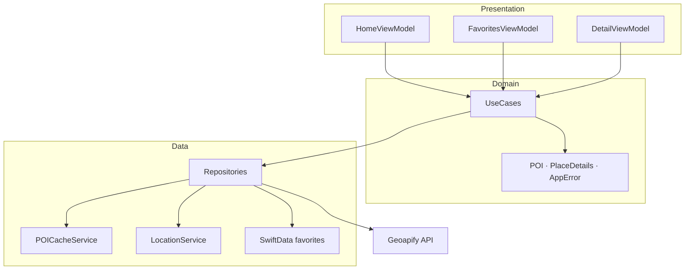
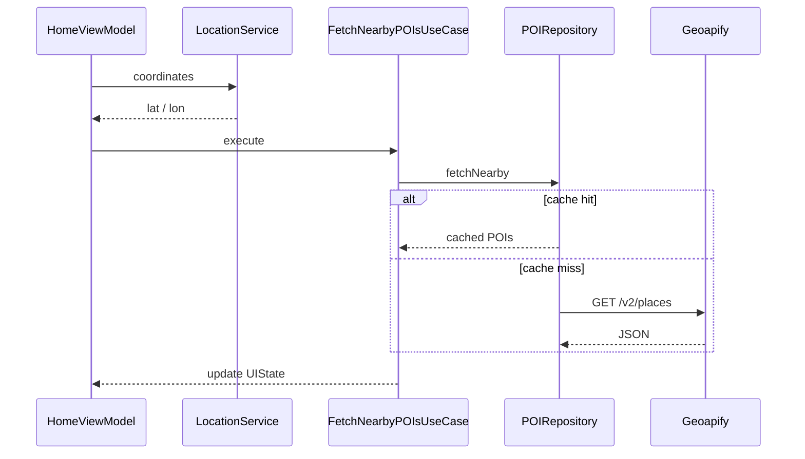
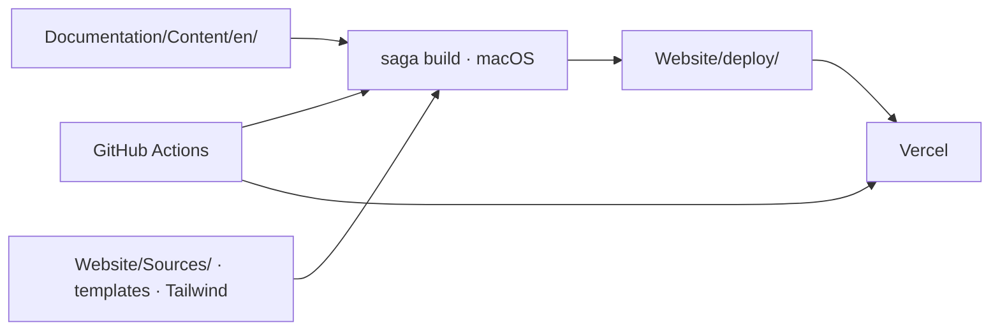

# Blueprint

Public iOS architecture reference built with SwiftUI.

**Discover** is the example app: it lists places near you (restaurants, museums, parks, hotels) using the [Geoapify API](https://www.geoapify.com/). The goal is not to ship a product, but to show how layers, protocols, and tests fit together in a real codebase you can run and read.

| | |
|---|---|
| **Docs (live)** | [ios-blueprint.vercel.app](https://ios-blueprint.vercel.app) |
| **Example app** | Discover · iOS 17+ |
| **License** | MIT |

---

## How Discover works

The app has two tabs: **Discover** (nearby POIs with pagination, push to **Detail** for place info and optional map) and **Favorites** (saved POIs in SwiftData, same Detail navigation).

ViewModels call UseCases. UseCases call Repositories through protocols. Repositories talk to Geoapify, disk cache, CoreLocation, or SwiftData. Presentation never imports those frameworks directly.



Loading nearby places (simplified):



**Dependency injection:** `DIContainer` wires bundles (`NetworkDependencies`, `POIDependencies`, …) and factories (`HomeFactory`, `DetailFactory`). Navigation uses `NavigationStack` + `AppRoute` behind `RouterProtocol`.

For layer diagrams, feature breakdown, and ADRs, see **[Architecture Overview](Documentation/Content/en/architecture/overview.md)** on the site.

---

## How the documentation site works

Markdown in `Documentation/Content/en/` is the source of truth. [Saga](https://getsaga.dev/) (Swift static site generator) reads those files, applies Tailwind + Mermaid, and writes HTML to `Website/deploy/`.



- **Local preview:** `./scripts/saga dev --port 3000`
- **Production:** GitHub Actions builds on macOS, Vercel serves the static output (Saga does not run on Vercel's build servers).
- **CI split:** changes only under `Website/` or `Documentation/` skip the iOS workflow.

Site stack and deploy details: **[Website/README.md](Website/README.md)** and **[Build & Preview](Documentation/Content/en/website/deploy.md)**.

---

## Repository layout

```
Blueprint/
├── blueprint/              App target — Presentation, Data, Domain, DI, Navigation
├── Packages/
│   ├── DesignSystem/       Spacing, typography, color, skeleton tokens
│   └── Networking/         NetworkClient protocol + URLSession implementation
├── blueprintTests/         Swift Testing — ViewModels, UseCases, mappers
├── Documentation/Content/  Docs source (en + pt-BR placeholder)
├── Website/                Saga pipeline → Website/deploy/
└── scripts/                saga wrapper, coverage check
```

---

## Quick start

**Requirements:** Xcode 16+, iOS 17 simulator, free [Geoapify key](https://www.geoapify.com/) (3,000 req/day).

```bash
git clone https://github.com/luizmellodev/Blueprint.git
cd Blueprint
cp Config.xcconfig.sample Config.xcconfig   # add your GEOAPIFY_API_KEY
open blueprint.xcodeproj
```

Run with **⌘R**. Tests with **⌘U**.

Step-by-step setup, API key injection, and simulator notes: **[Getting Started](Documentation/Content/en/guides/getting-started.md)**.

---

## Documentation

| Section | Topics |
|---|---|
| [Guides](Documentation/Content/en/guides/) | Setup, tests, CI/CD, contributing |
| [Architecture](Documentation/Content/en/architecture/) | Layers, MVVM, DI, networking, persistence |
| [Concepts](Documentation/Content/en/concepts/) | Observation, Repository, UseCase patterns |
| [Decisions](Documentation/Content/en/decisions/) | ADRs — why each choice was made |
| [Website](Documentation/Content/en/website/) | Saga, Tailwind, Mermaid, deploy |

**Read online:** [ios-blueprint.vercel.app](https://ios-blueprint.vercel.app)

Code shows *how*. Docs explain *why*.

---

## Quality

GitHub Actions runs SwiftLint and `xcodebuild test` when Swift sources change. Coverage floor is **20%** on the app target today; **70%** is the long-term goal. See [Running Tests](Documentation/Content/en/guides/running-tests.md) and [CI/CD](Documentation/Content/en/guides/ci-cd.md).

Contributing: **[CONTRIBUTING.md](CONTRIBUTING.md)**

---

## Author

**Luiz Mello** — [@luizmellodev](https://github.com/luizmellodev)

Architecture patterns adapted from [Native Birds](https://github.com/spanesso/native-birds) by Sebastian Panesso.

---

## License

MIT
